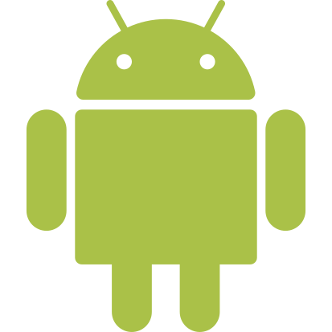

# Software Suite
We made a highly advanced software suite that scales along with your problem.

 This means for example that the work of the engine can be offloaded to other PCs to increase the accuracy of the positions.

The viewer and engine software runs on most devices (iOS, macOS, Android, Windows, Linux).

## cxRTLS
cxRTLS serves as the main program. It will allow you to configure the system and tweak all the parameters. The all-in-one software includes a configurator, viewer, engine, logger, sensor visualizer, multiple data servers, etc. The program can run centralized or decentralized for big setups.

Some of the main features are described below.

#### CrossView
Do you need a clear overview of the distances between the tags and the anchors? In the Cross you can select the combination of anchors and tags that you want to see the table. You can view the most recent measurements in a graph.
Besides the anchor-tag crossview, you can also view the inter-anchor cross. This will display all distances as measured between the anchors.

#### Replay
Record live data to be able to replay it afterwards. When reviewing, you can play the recorded data forward and backwards. You can write notes on specific events.
Crop the data and resave.

#### Bridge

#### Internal Viewer
With the internal viewer you can immediately see where your objects are. How are your anchors located, ...

Import the map and calibrate it with the system.

#### LogConn
Log all the data coming from and to the TCP and UDP server.

#### OTA updates
Update the firmware of your nodes on the fly. Select any firmware you want and push it to the system.

#### Sniff
In the sniff you can see a graphical view of all the signals in the air. Compare it to an oscilloscope for electrical signals.

Note:
cxRTLS will run in demo-mode without a valid license.

## cxVIEWER
cxViewer shows the positions of all (or a selected group of) the tags on your screen of choice. Do you want to show your map on a big TV screen without any other bloath, cxVIEWER is your way to go.

cxViewer runs without a license.

## cxENGINE
Whenever you need to get the maximum out of your machines, you can use cxENGINE to distribute the work load of the position calculations between multiple PCs. cxENGINE works close together with cxRTLS. All running instances will automatically balance the workload between each other. By adding more instances, you can increase the accuracy of the positions.
