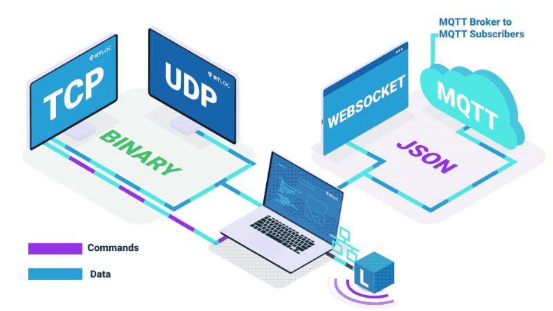

# APIs
There are different ways to integrate with the RTLOC system, depending on your needs.

<!--  -->
<AnimApis />

## Real-time device data
The position and sensor data for each device can be accessed in real-time in the following ways:

* **[`Local JSON over MQTT`](/api/api_engine_local_mqtt.html)**:
  - Easy to understand, easy to integrate JSON format
  - Pub/sub per topic type because of MQTT
  - Most-complete API with zone information, events
  - Access data over websocket from a browser (MQTT over websocket) or over TCP (MQTT over TCP) in a script or program

* **[`Cloud JSON over MQTT`](/api/api_engine_cloud_mqtt.html)**: Use your own broker to receive the above data

* **[`Binary over TCP`](/api/api_engine_local_bin.html)**:
  - Compact format, requiring some more decoding effort
  - Includes raw data direct from the engine, no zone/event/race data

## Meta data

* **Single device** (tag / anchor) information can be read through the CLI or via Bluetooth (BLE).
  - [`BLE API`](/api/api_ble.html) - Make a wireless connection with one of the tags with our BLE interface.
  - [`Device CLI`](/api/api_console.html) - Access the RTLS hardware (anchors and tags) via one of the [interfaces](/embedded/#interfaces).

## Custom firmware toolkit

* If you want to go low-level build your own **firmware** and run it next to ours using our [`firmware library`](/api/api_firmware.html)

<!-- ## Overview
The following image gives an overview of where the APIs reside within the system architecture.
 -->
