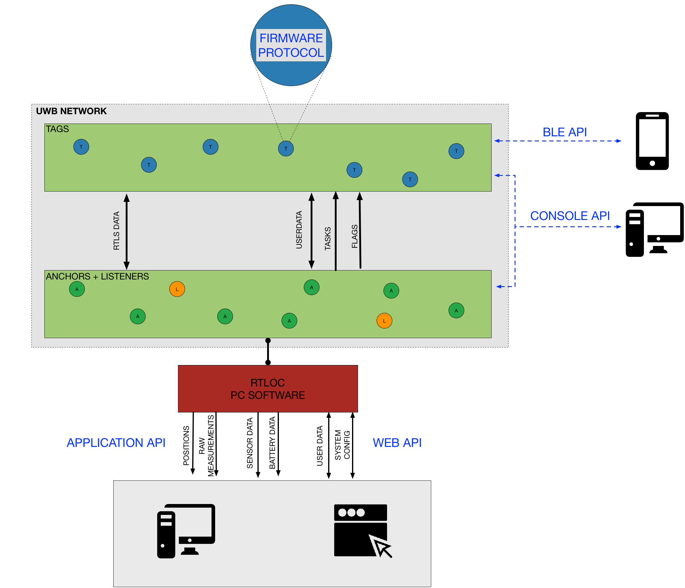

# APIs
There are different ways to integrate with the RTLOC system, depending on your needs:
* "External" API's: get position and sensor data from our system, send basic commands
  - [`Binary API`](/api/api_application.html) - Interact in a native (PC, phone or tablet) application. Allows for fast and compact transmission over TCP/UDP.
  - [`JSON websocket API`](/api/api_web.html) - Suitable for web- or cloud-oriented apps. Receive data over direct websocket or through an MQTT broker (TCP or websocket).
  - [`BLE API`](/api/api_ble.html) - Make a wireless connection with one of the tags or anchors via the Bluetooth Low Energy protocol.

* Internal API's: for extra control over devices
  - [`Device CLI`](/api/api_console.html) - Access the RTLS hardware (anchors and tags) via one of the [interfaces](/hardware/#interfaces).
  - [`Firmware API`](/api/api_firmware.html) - Build your own firmware (if you want to go low-level), run it next to our firmware

## Overview
The following image gives an overview of where the APIs reside within the system architecture.

