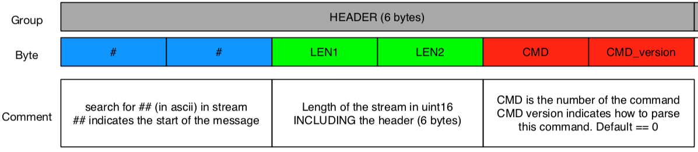

# Binary API

The Binary API provides a compact representation of the real-time data stream. It can be accessed over UDP, TCP or websocket.

## Preamble

Every message will contain a preamble with the following format:

## Commands

Depending on the command indicated in the preamble, the rest of the message will be decoded as indicated below.

<ApiApp></ApiApp>

> the "GET" commands can be sent to retrieve the corresponding data