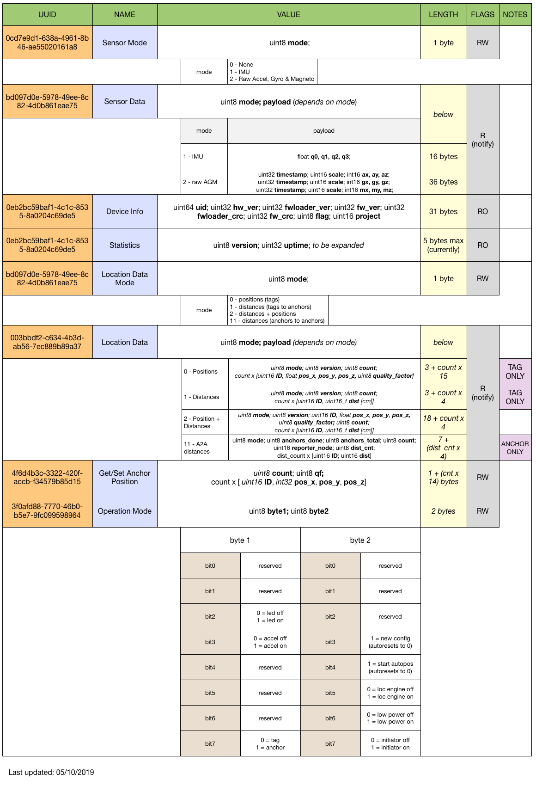

# BLE API

Our BLE implementation largely follows Decawave's BLE spec ("PANS").
It allows for:
* Device information
* Receive distances/positions
* Perform autopositioning
* ...and more

Download the specification [here](http://callitrix.com/assets/docs/files/api_ble.pdf) or see below. Service ID: *680c21d9-c946-4c1f-9c11-baa1c21329e7*.

(detailed overview coming soon)