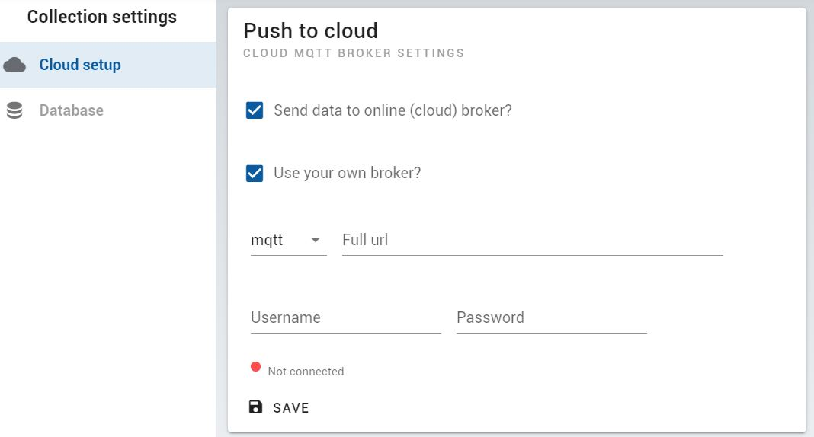
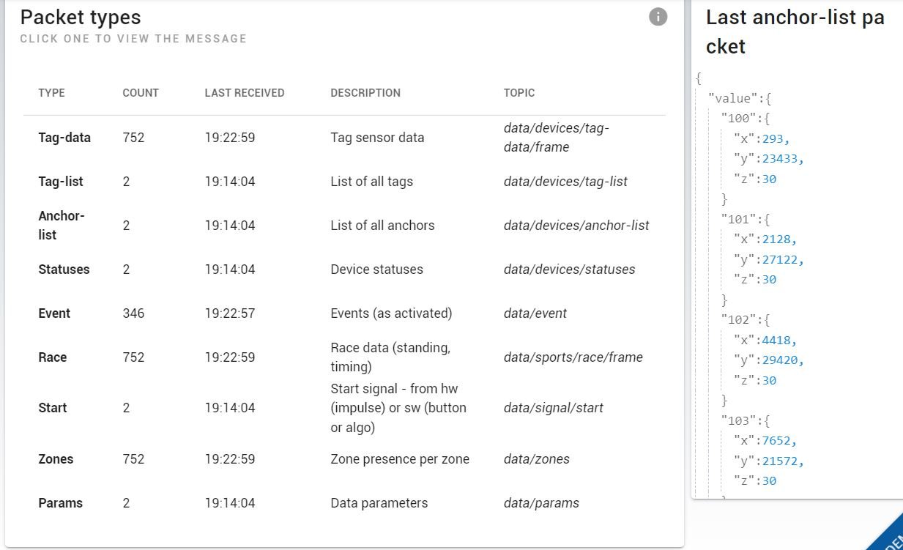

# Cloud live (MQTT JSON) data [Alpha]

Real-time data (position data, tag/anchor statuses, sensor data, etc.) can be received over MQTT (Message Queuing Telemetry Transport, pub/sub), either direct over TCP or over Websocket.

## 1. Connection protocol

You can publish data to your own Mosquitto (MQTT) broker by configuring the Desktop application:



<!-- The MQTT topic and data format per type of message is outlined in the [JSON format description](/api/api_web.html). -->


## 2. Data Format
Each message has the following base format:

``` JSON
{
  "time": "", // Time: GPS time of anchor if available, otherwise PC time
  "meta": { // Meta information
    "data_source": "live",
    ...
  },
  "value": { // Value: message data
    ...
  }
}

```
These are the message types and their associated topics:

<MqttTable></MqttTable>

Example *tag-data* message:

``` JSON
{
  "time":"2022-02-26T10:07:19.128Z",
  "meta":{
    "msg_type":"tag-data",
    "data_source":"replay-cx"
  },
  "value": {
      "frame": 658885,
      "tags": {
        "2012": {
            "pos": {"x": 9356,"y": 23872,"z": 0},
            "speed": {
              "value": 4.61,
              "dir": {"x": 0.94174,"y": 0.33634}
            }
          },
        "2014": {
            "pos":{"x": 12437,"y": 23806,"z": 0},
            "speed": {
              "value": 5.07,
              "dir":{"x": 0.89907,"y": -0.43781}
            }
          },
        ...
      }
  }
```

The messages received can be inspected interactively in our app:

