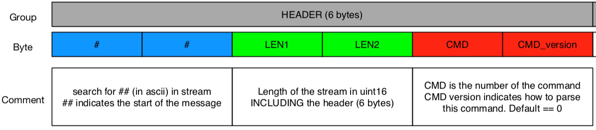

# Local live data

Real-time data (position data, tag/anchor statuses, sensor data, etc.) can be received over UDP/TCP, in binary format.

## 1. Connection protocol

1. Configure data transmission over UDP / TCP / websocket in our desktop application (in the API view)

2. Connect to your computer/server to the correct IP + port

## 2. Data Format

### Preamble

Every message will contain a preamble with the following format:

### Commands

Depending on the command indicated in the preamble, the rest of the message will be decoded as indicated below.

<ApiApp></ApiApp>

> the "GET" commands can be sent to retrieve the corresponding data

## Code examples
Check out basic code examples at [https://github.com/RT-LOC/APIs](https://github.com/RT-LOC/APIs) (C, Python, Javascript)
