# Actions
The extra bar gives you access to all kind of extra data and information. A range of dedicated windows are available with  specific functionality.

The functionality ranges from sending tasks to any of the nodes, to keeping track of the CPU & memory usage of the software.

## DW
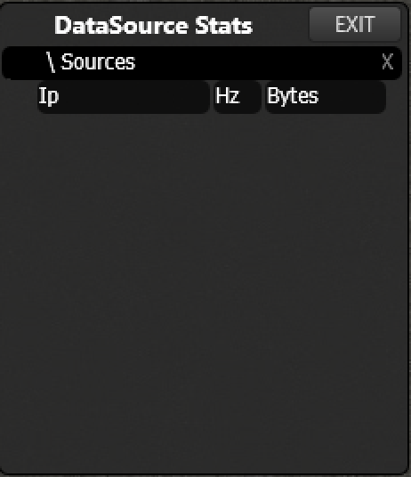

## Task

## Task History
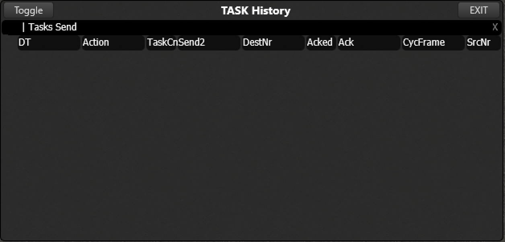

## Link
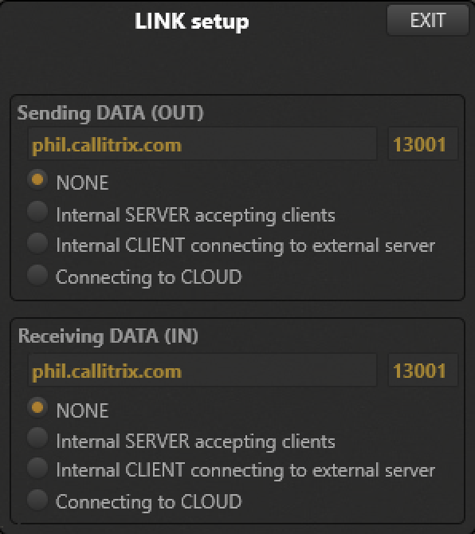

## USB
The USB console gives you direct control over the connected node. You can read out the most important parameters directly such as:
- Hardwareversion
- Uptime
- Antenna delay values
- Identifier
- Versions and crc's of bootloader, firmwareloader, anchorFW, tagFW and the subversionnumber.
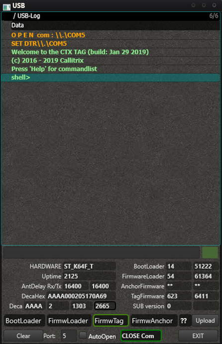

The console can be accessed from any of the possible firmwares (bootloader, fwloader, anchorFW, tagFW). The green box indicates the current FW.

There are several commands available that give you more control over the node. Type `help` to get an idea of the commands.
A detailed list of all the commands and more info on how to use the console yourself can be found [here](/cxRTLS/cxRTLS_console.html).

You can also update the FW of the node through the USB window. More information can be found [here](cxRTLS_fwup.html#3-3-usb).

By toggling AutoOpen, the USB connection will automatically be opened as soon as the host computer feels that a device is attached.

Are you having problems with connecting the node? [Click here](LINKREQUIRED) to look for a possible solution.

## Debug
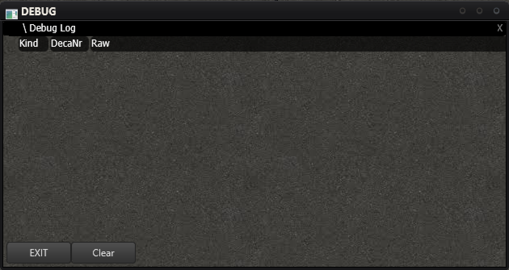

## Event
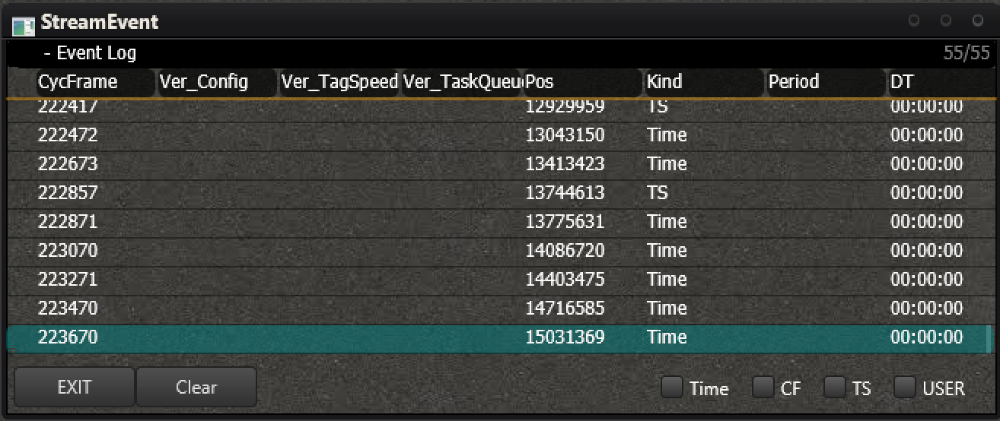

## Net
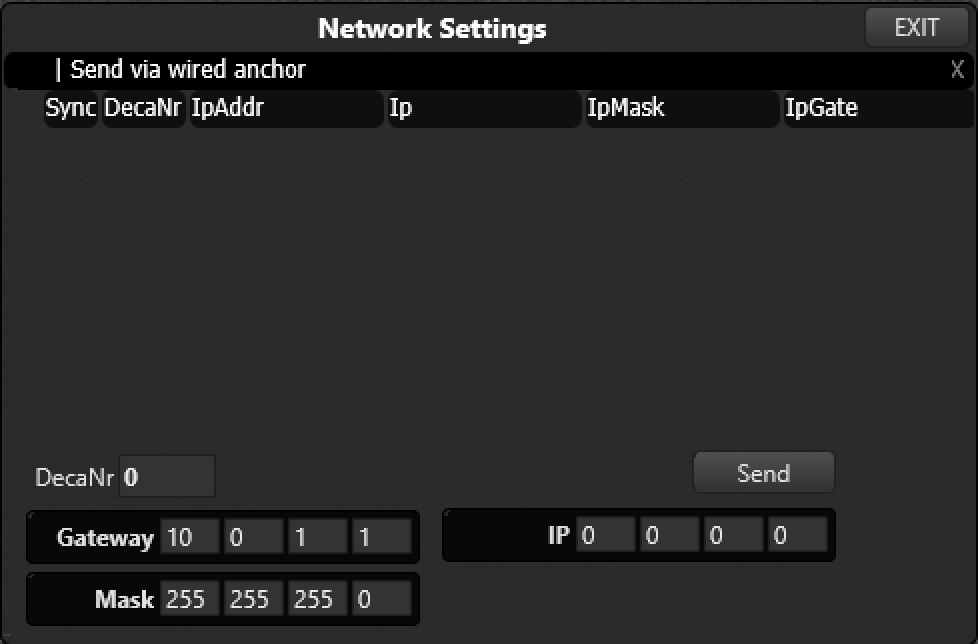

## Volt

## CPU

## ACr
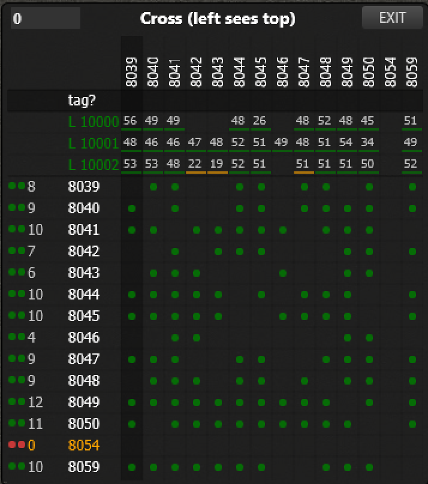

## Prop
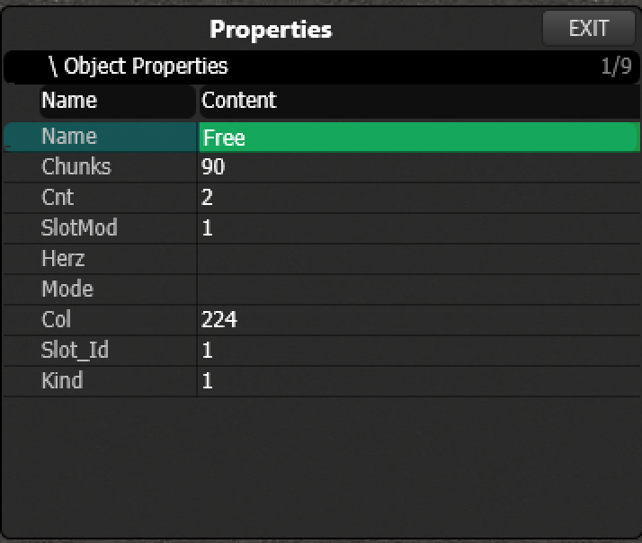

## GPS
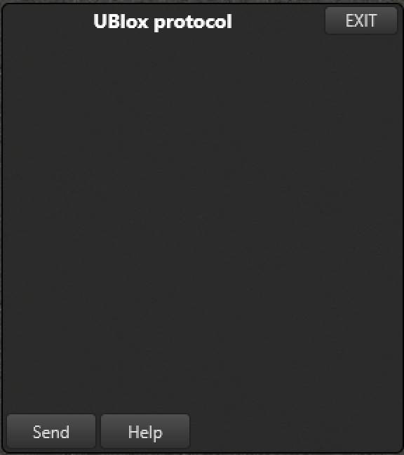

## Queue
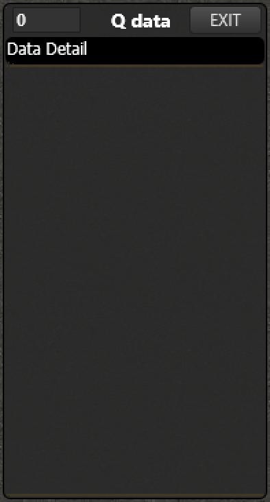
