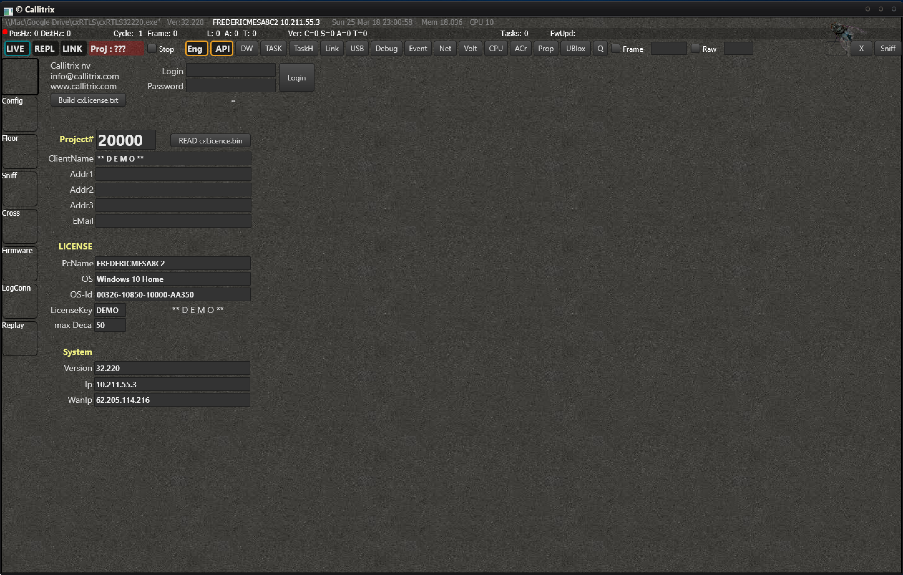

# Concepts
In order to get the best out of the system, it is helpful to understand some of the concepts that are at the base of our system.
It will be easier for you to understand some parts of the documentation if you have a good grasp of the terminology that we handle.

[[toc]]

## Join requests
Whenever a new tag or anchor is switched on within reach of the system, it will make itself known through a 'Join Request'.
The amount of new tags and anchors will appear in box in the right upper corner.

The new tags and anchors will become visible when you open the 'Join & Projects requests' window. In here, they can be added to the system.

After adding them to the system, the tags will have received a slow slot automatically (whenever available). Anchors will only receive a slot automatically whenever this Automatic slot assignment is on. Otherwise assign the anchor a slot manually.

## Frames

## Listener

## Hairs

## Tasks
With a task you can send commands or settings to a single anchor/tag or multiple at once. More info [here](cxRTLS_tasks.html).

