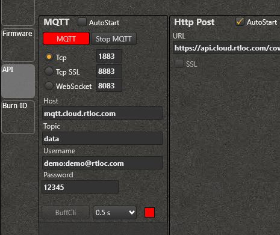
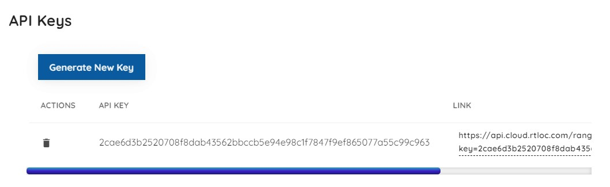

# Gateway to Ranger software

## Install the Ranger software

A convenient way to manage our tools is the Desktop app. You can get it at [https://app.rtloc.com/download](https://app.rtloc.com/download). (Currently Windows only, requires some space on the C drive). From the Desktop app you can download the Ranger app.
Another option is to install the Ranger app by itself, you can request the executable from us.

## Set up gateway (or "listener")

Power the gateway (micro USB) and connect it to LAN. If the gateway has a (recent) gateway firmware it should automatically be detected and show up in the list of devices.

If you're using an RTLS anchor device, you will need to re-flash it as a gateway first in the firmware screen:

## Setting up tags

When turning on tags, they should automatically appear in the tag list. When tags go offline, they'll have a red dot indicator which turns green again when you turn them on.

## Accessing data (API)

The distance and event data can be exported to your own application using one of our APIs. Current options include REST (HTTP POST) or MQTT (publishing to a broker, to which your client can subscribe).

### MQTT

To configure MQTT you'll have to provide the broker link, login credentials and the topic to post to.
You can use our MQTT broker for basic testing, but for reliable daily use we recommend setting up your own broker (e.g. RabbitMQ). If you need an example of MQTT client code, we have python and Javascript examples on our Github: [MQTT API example](https://github.com/RT-LOC/API-examples/tree/master/Data%20API/MQTT).

In the Ranger program, you can use your account credentials like so (for demo@rtloc.com):

> You can use this demo account for testing. Choose a unique topic name to prevent overlap with someone else's data though.

### HTTP POST

For the REST option you'll have to provide the POST route of your or our back-end. The program will then regularly post events to it once there are enough gathered.

If you choose to use our backend, you need to generate an API key and use the associated POST link. This can be found in the "Ranging settings". It looks like this:

