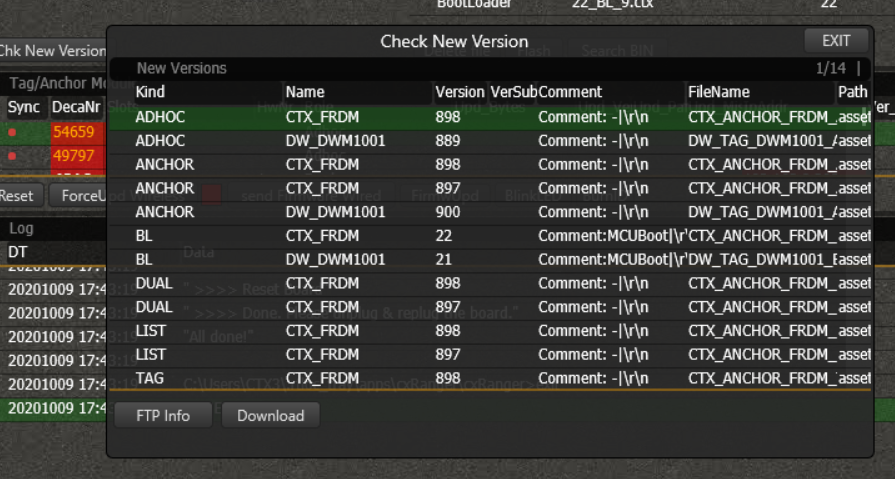

# Gateway to Ranger software

## Set up gateway

Power the gateway (micro USB) and connect it to LAN. If the gateway has a (recent) gateway firmware it should automatically be detected and show up in the list of devices.

If you're using an RTLS anchor device, you will need to re-flash it as a gateway first.

## Setting up tags

When turning on tags, they should automatically appear in the tag list.

## Accessing data (API)

