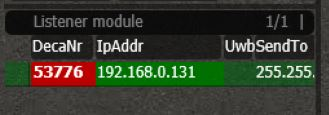
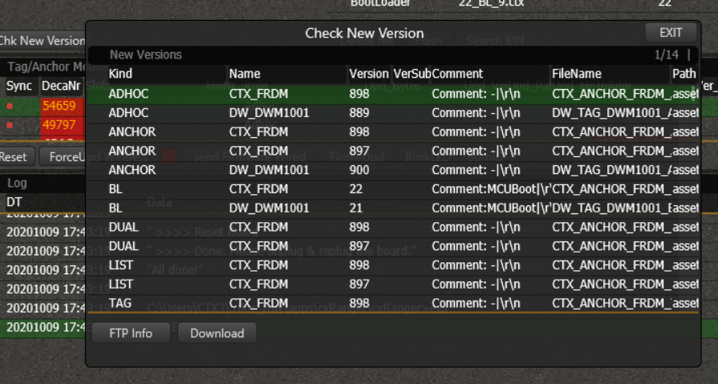
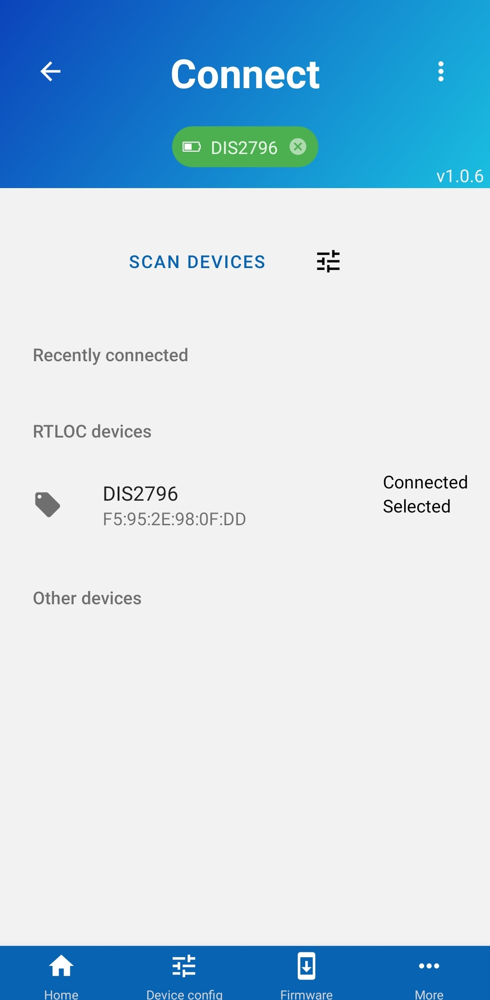
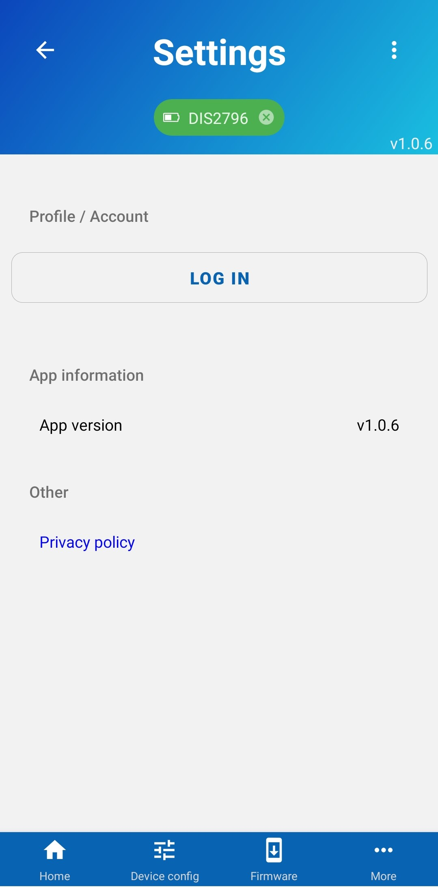
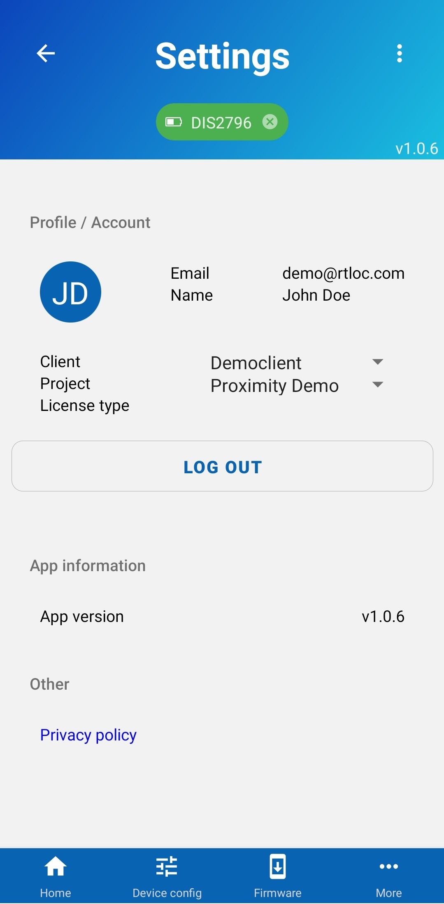
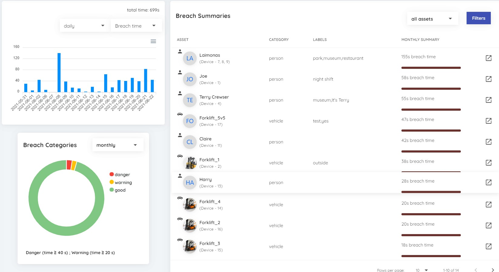

::: danger REMARK
This guide was written for our original software (desktop v1) and is yet to be adapted to reflect the latest changes. The necessary steps are similar with recent software.
:::

# Getting started with Proximity ranging

## Introduction

The Distance Tracking System is a variation of a `Mobile Ad-hoc Network` or `MANET`. It allows you to measure distances between different tags that have joined an ad-hoc network.
The tags join the ad-hoc network and immediately start ranging. This means **no infrastructure** is needed and the whole administration and regulation of the network is done automagically.

Note: in a Distance Tracking system there are no anchors, and no positions are calculated, just distances!

## Necessary equipment

Before you get started, make sure you have the following hardware:

#### Ultra-wideband devices

#### Optional: gateway

The gateway device will allow a connection with our PC software described below.

## Data collection: Desktop software

If you have a gateway, you can connect to our Ranger program to:

-   export data to the PC program
-   allow debugging of the active devices
-   allow over-the-air (OTA) over UWB updates of all device firmwares

You can conveniently install the Ranger app via our central Hub application (Windows), downloadable via [https://app.rtloc.com/download](https://app.rtloc.com/download).

### Connecting devices

Start by powering your devices (battery or mains), and connect one or more gateways to your LAN. You should see the gateway, or "listener" appear in the visualization screen:

### Updating firmware

A tag or gateway might have not have the most recent firmware. In that case you best [update the firmware](/reference/fwupdate) for the device by re-flashing it over USB.

### Accessing data

Check out the [gateway to desktop](/distancing/gateway_desktop.html) API description.

## Data collection: Mobile app

::: warning
Currently the mobile app is only available on Android devices. iOS support is planned to be released in the future
:::

You can connect your tag to our Mobile app to:

-   allow over-the-air (OTA) device firmware updates
-   change device characteristics (such as breach distance)
-   send breach data to the RTLOC backend or your own
-   and more...

The Android version of the app can be downloaded from [Google Play](https://play.google.com/store/apps/details?id=com.rtloc.debug).

### Connecting devices

Power your device and open our mobile app on your phone. From the app, scan for devices and once your device is found, press on it to get connected. You should see a green indicator at the top, indicating that you are connected. More detailed instructions [here](/mobile/connecting).

### Updating firmware

A tag might have not have the most recent firmware. You can update your tags directly from your phone through Bluetooth. Navigate to the "Device firmware" screen and follow the instruction. You can find more detailed instructions [here](/reference/fwupdate.html#_2-over-ble-dfu).

### Accessing data

Every breach event is automatically sent to RTLOC backend, which then can be viewed through our Portal app. But before these events can be sent, you will need to login through the Mobile app. Login form can be found in the "Settings" screen. Once you are logged in, **choose the client and project** you want your events to be sent to. Now wait for any breach event and view the them in the Portal app. More detailed instructions [here](/mobile/sending-data).

## Data visualization: Portal app

Our Portal app solution is an easy way to visualize your breach events. It offers:

-   The full chronological log of every breach event sent to our server.
-   Assignment of devices to assets (people, vehicles, object and etc.), which will filter and show detailed information about the asset.
-   Aggregated project and asset statistics.

