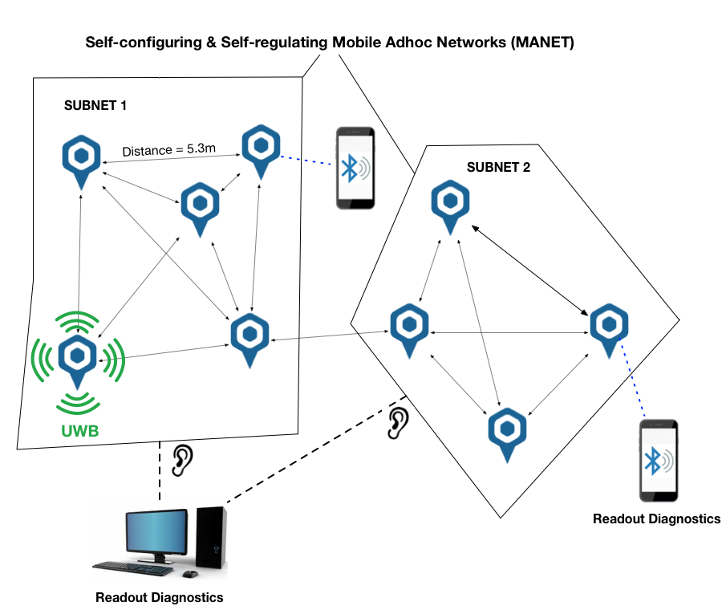

# Getting started

## Introduction
The Distance Tracking System is a variation of a `Mobile Ad-hoc Network` or `MANET`. It allows you to measure distances between different tags that have joined an ad-hoc network.
The tags join the ad-hoc network and immediately start ranging. This means **no infrastructure** is needed and the whole administration and regulation of the network is done automagically.

Note: in a Distance Tracking system there are no anchors, and no positions are calculated, just distances!



## Necessary equipment

Before you get started, make sure you have the following hardware:

### Positioning devices


```
  - 2 Tags
```

### Power supplies
  

```
  - 2 Micro usb cables (type B) and batteries
  or
  - 2 LiPo batteries
```

### Optional: gateway
The gateway device will allow a connection with our PC software described below.

  

## Software set-up

If you have a gateway, you can connect to our Ranger program to:
- export data to the PC program
- allow debugging of the active devices
- allow over-the-air (OTA) over UWB updates of all device firmwares

You can conveniently install the Ranger app via our central Windows application, downloadable via https://cloud.rtloc.com/download.
