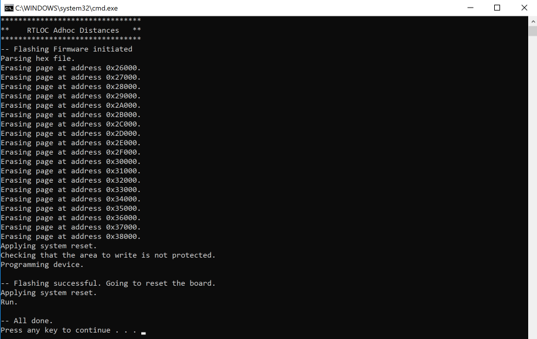

# Flashing the boards
In order to get the boards running, we need to flash the correct (latest and greatest) firmware on the boards.
How that is done is explained here.

<!-- ::: warning    
This guide only applies for DWM1001 boards. In order to (re)flash the other hardware, contact us.
::: -->
## Easy (re-)flashing

### RTLOC app
You can easily (re-)flash your hardware using our app. In the firmware tab get and select the appropriate firmware. Then press the "flash firmware" button and check completion in the console. The "flash all" checkbox allows to also re-flash bootloader and firmware loader when flashing firmware.


### Engine: over-the-air updating
We also support over-the-air (OTA) firmware updates. From our Engine app, a firmware can be selected to be downloaded and installed over UWB by all devices.

## Architecture
The flash architecture is as follows:

---- 0x0

S132 SOFTDEVICE


---- 0x24000

CURRENTLY EMPTY

---- 0x26000

APPLICATION


---- 0x40000

CURRENTLY EMPTY


---- 0x80000

We need to make sure the softdevice and the firmware are flashed.
Once the softdevice is flashed, you will not need to update it again. Firmwares can be updated.

## Flashing
### Prerequisites
In order to flash the boards, you need to have a tool installed that can do the trick.
This can be done with `nrfjprog` or `J-Flash Light` tool. Here we will explain `nrfjprog`.
Whenever you have installed the tool, all you need to do is run the scripts that are provided (and make sure the scripts are referring to the correct binary file). Make sure you have downloaded the last scripts & binaries.

### nrfjprog
nrfjprog is a command line tool that we can call from the Command Prompt(win)/terminal(linux).
More information on how to install and use nrfjprog can be found [here](http://infocenter.nordicsemi.com/index.jsp?topic=%2Fcom.nordic.infocenter.tools%2Fdita%2Ftools%2Fnrf5x_command_line_tools%2Fnrf5x_command_line_tools_lpage.html).
Note that you don't really need to know how to use it, as this will be done in the scripts.

### Scripts
The scripts are provided for Windows and Linux. A script is provided to flash the Softdevice in case that hasn't been done yet and a separate script is to flash the firmware.
#### Windows
Find the following file in the file explorer and double-click it:
```
[PATH_TO]/current/scripts/f_tag.bat
```
You should see something similar:



If this is the case, you can skip the rest of this paragraph.

It could be that the board is not well attached to the PC (especially when you're running a VM). You might see the following in this case:


Make sure the board is recognized by the PC. You should see the *JLink CDC UART port* in the Device Engine:


#### Linux
Change the active directory in the terminal to:
```     
cd [PATH_TO]/current/scripts/
```
and run the following script:
```
./f_tag.sh
```
You should see something like this:


## Verification
If you have successfully flashed the board, it will automatically restart and start running.
The third LED from the top should start blinking red and green after a couple of seconds. This means it is sending and receiving packets. Did this not work? Try to reset the tag by replugging the USB cable. If it is still not working, try to reflash.
You can also verify that you can make a BLE connection. You can find more information on BLE [here](/embedded/hw_interface_ble.html).
