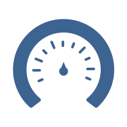
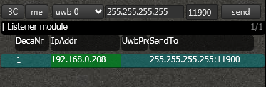

## Which sensors are available?
Not all sensors are available on all boards. The following table shows which sensors are available on which board.

||  ||  |  |
|:--:| :-----------------: |:-------------:| :---------:  | :---------:  |
|**Tag**| YES   | YES       | YES       |NO       |
|**Anchor**| YES   | YES       | YES       |NO |
|**Listener**|YES   | YES       | YES       | NO    |

> (left to right) accelerometer, magnetometer, gyroscope, pressure sensor
<!-- accelerometer to measure non-gravitational accelerations
gyroscope to measure angular velocity
magnetometer to measure the earths magnetic field -->

## How many times can I sample?
You can access **all** sensors samples, according to the sample rate  to their maximum possible sensor rates.
Via our API, you will be able to access the raw sensor data samples up to 1000 times per second, per tag. These samples are labelled with accurate globally synchronized timestamps. This gives you the possibility to develop and run your own sensor fusion algorithm on a PC or do other useful things with it.

## How are the sensors configured by default?

| Sensor            | Sample rate   | Resolution  |
| ----------------- |-------------| ---------  |
| `Accelerometer`   | 1000 Hz       | +- 4g       |
| `Gyroscope`       | 1000 Hz       |  +-2000dgr/s |
| `Magnetometer`    | 18 Hz         |  48 gauss   |

## Can I change the sensor configuration?
You can change the configuration via our Tag Development Kit (TDK).

