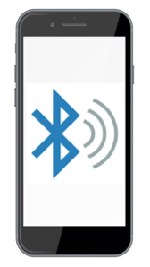

# Distance Tracking

## Introduction
The Distance Tracking System is a variation of a `Mobile Adhoc Network` or `MANET`. It allows you to measure distances between different tags that have joined an adhoc network.
The tags join the adhoc network and immediately start ranging. This means **no infrastructure** is needed and the whole administration and regulation of the network is done automagically.

Note: in a Distance Tracking system there are no anchors, and no positions are calculated, just distances!


## Basic requirements
Before you get started, make sure you have at least the following hardware:

### Positioning devices


```
  - 2 Tags
```

### Networking equipment


```
  - 1 Phone or Tablet (with BLE)
```

### Power supplies
  

```
  - 2 Micro usb cables (type B) and batteries
  or
  - 2 LiPo batteries
```

## Getting Started
If you have our RTLS introduction kit, the devices should already have the necessary firmware.
If your tags are not flashed with the Adhoc Firmware, you will have to do that manually. Take a look at our guide of [hardware flashing](/hardware/flashing/hw_flashing.html).

1. Power all devices over USB (using a power adapter or a battery)

2. Open the web portal [https://cloud.rtloc.com/ble](https://cloud.rtloc.com/ble) and press the Bluetooth icon, select "Connect to device"

3. Select a tag

4. 

### More details on BLE
Bluetooth Low Energy gives us the possibility to read out the data (distances) on any phone/tablet/... that supports BLE 4.0 (basically any recent device).
More information [here](/hardware/hw_interface_ble.html).

## Other interfaces
In order to get data out of the system, we somehow need to interface with the tags. Other connection methods (apart from BLE):
- BLE (wireless)
- USB (wired)
- Network Sniffer (advanced)


### USB
We can read out the device via a USB cable. More info will follow.

`NOTE: Not supported yet`

### Network Sniffer
The Network Sniffer enables all the advanced features of the system.
You can read out all the distances from all the tags that are in UWB range, see signal quality figures, debug timing, adhoc settings and much more.
More information [here](/hardware/hw_interface_sniffer.html).
