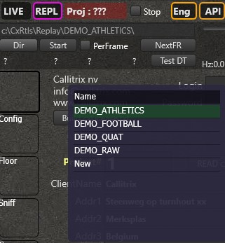
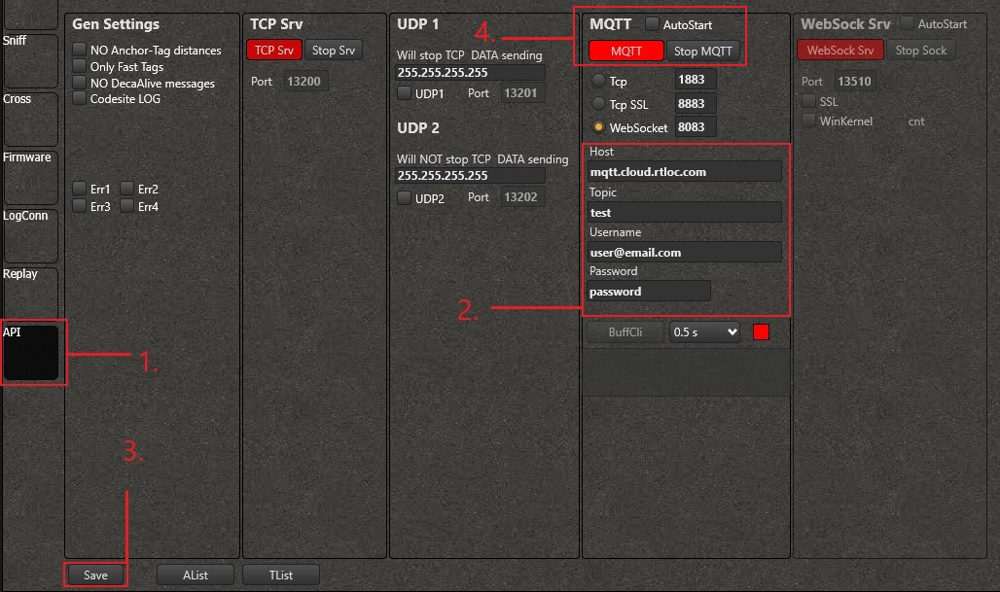

# Trying Demo Replays

## Introduction
If you don't yet have our [devices](https://rtloc.com/product/), you can still try out our software. In this tutorial we will show you how our products work using [replays](../manager/cxRTLS_replay.html#logging). This will give you a basic understanding of how to setup our software.

## Hub App Setup
We will need to download and install [RTLOC Hub app](https://cloud.rtloc.com/download). Once installed login using your account and download the license from account view. [License download instructions](../hub/license.html)

After that download _'Demo Replays'_. These [replays](../manager/cxRTLS_replay.html#logging) allow you to replay all the data from positioning devices as if it is happening live. 


Lastly download RTManager and open it.


## RTManager
RTManager is the main application that collects all of the data. Using this app we can view data live, replay it, send it over the internet and [more](../manager/). 

First if we want to replay the data, we need to change the View Mode to Replay. Click on _'REPL'_ to switch to the `Replay View Mode`


Now we need to select a file we want to replay. Click on _'Dir'_ to open a window that shows all the logfiles under:
```
c:\cxRTLS\Replay\
```
If you have downloaded Demo Replays, you should see some *'DEMO_'* files. Now double click on any of the files to activate it (for this example we are using _'DEMO_FOOTBALL'_). When you press _'Start'_, the file will automatically start to play.



Then we need to make sure the engine is running:
1. Click on _'Eng'_ to open the engine menu.
2. Unselect _'Skip Engine'_ to activate the engine.
3. Click on _'Floor'_ in the left side [menu](../manager/cxRTLS_layout.html#menu).


If everything is correct you should see a circle moving around on the screen. More info about the manager [here](../manager/). 

## API setup

If you want to send the data from the RTManager to our [cloud server](https://cloud.rtloc.com/) or any other computer there are multiple ways to do it. [API Docs](http://localhost:8080/api/)

### RTLOC cloud

Sending data to RTLOC cloud can be done through the RTManager:
1. Click on _'API'_ in the left side [menu](../manager/cxRTLS_layout.html#menu).
2. Fill in the forms with the correct [information](https://cloud.rtloc.com/settings/connection).
3. Click _'Save'_.

Now all the data is sent to RTLOC cloud and can be viewed from [there](https://cloud.rtloc.com/).

### TCP_Binary connection

[TCP_Binary](http://localhost:8080/api/api_application.html) connection allows for fast and very compact transmission over TCP/UDP. It is useful for fast data transfers to your own servers.

In this example we will be using [Python example](https://github.com/RT-LOC/API-examples/tree/master/Data%20API/TCP_binary/Python) code to create a connection, when everything is running on our local machine. Make sure Python is installed ([link](https://www.python.org/downloads/)). 

:::warning
  Ensure you set the right port inside the code!
* 13100 - For Live data
* 13200 - For Replay data

Since we are using replays we need to use port 13200. Example inside _'tcp_client.py'_:
```
loop = asyncio.get_event_loop()
#NOTE: use port 13100 to connect to LIVE server, use 13200 to connect to REPLAY server.
coro = loop.create_connection(lambda: ApiClient(loop), ip_addr_server, 13200)
loop.run_until_complete(coro)
loop.run_forever()
loop.close()
```

:::

When everything is ready, use this in the command line (or terminal):
```
python3 tcp_client.py localhost  //<-- or IP adress of your server
```

Now you should see something like this:


More TCP_Binary connection [examples](https://github.com/RT-LOC/API-examples/tree/master/Data%20API/TCP_binary).

### MQTT

For MQTT data connection, please refer to this [guide](http://localhost:8080/api/api_conns.html#_2-mqtt-data-connection).

