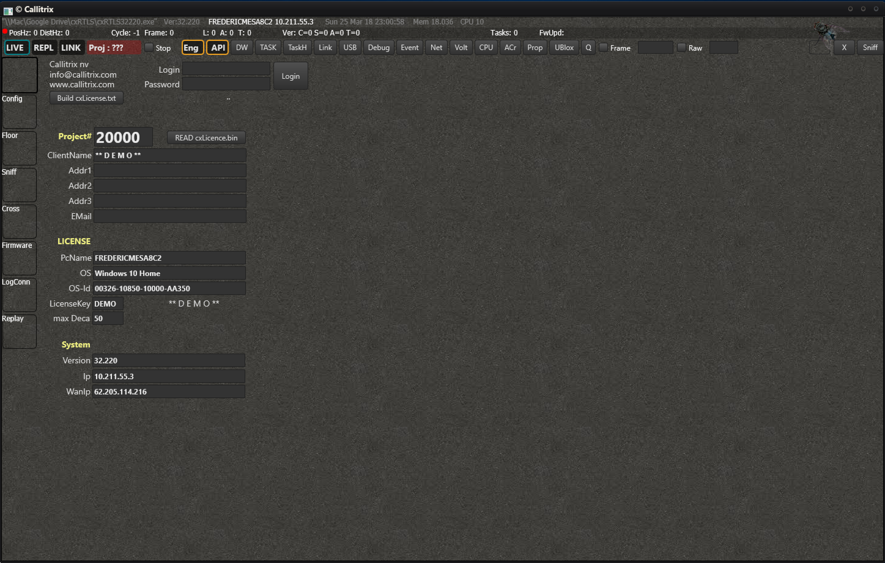
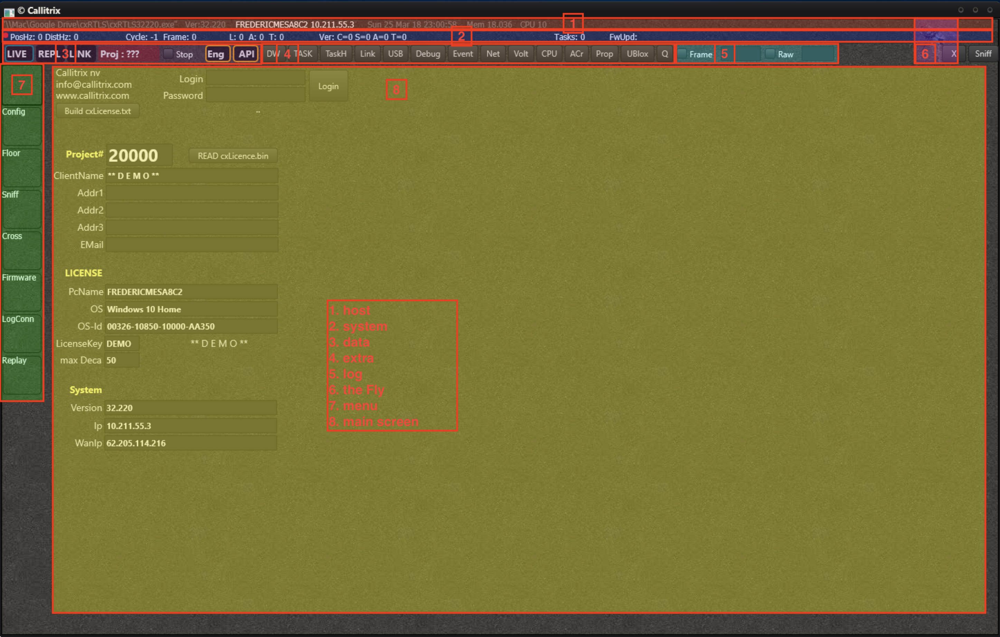
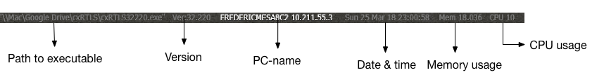
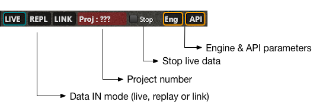
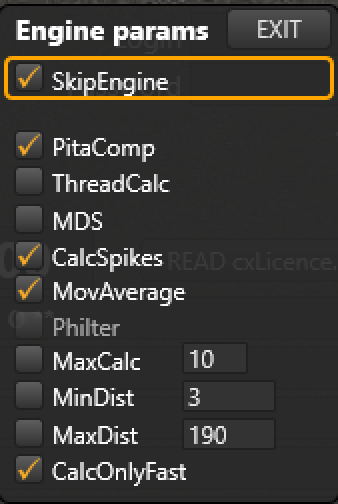
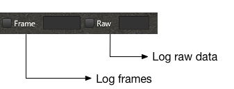
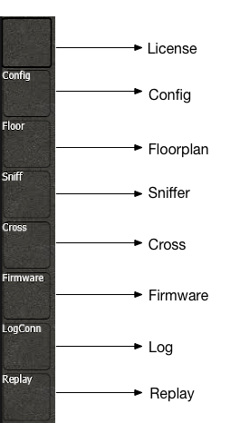

# Introduction to cxRTLS
## Description
cxRTLS is the main program from the software suite. You can configure, manage and analyze the full system with it.
It is designed to be as efficient as possible when it comes to memory consumption and CPU usage, without compromising on performance.
It runs on Windows 7 or later versions and requires around 30MB of storage.

## Overview
When you open the program, you will see something similar:

The program consists of multiple bars and menus:

 1. host bar
 2. system bar
 3. data bar
 4. extra bar
 5. log bar
 6. the Fly
 7. menu
 8. main screen

First we will describe all the bars and menus.
 ### Host bar
 The host bar contains information from the host PC.
 You will find:
  * The path the executable
  * The version of the software
  * The name of the PC
  * The current day and timebase
  * The current memory usage of the program
  * The current CPU usage of the program
 

### System bar
The system bar contains the most important data from the RTLS system. It will show you:
 * A live indicator whether or not data is coming in
 * How many positions & distances are measured every second [Hz]
 * The cycle & frame count
 * The amount of tags, anchors and listeners that are online (i.e. recently seen)
 * The version of the config- & tagspeedfile
 * The version of the anchor- & tagfirmware
 * The last task number
 * The firmware update status

### Data bar
The data bar is a collection of buttons that give you control over data input and output, as well as processing of the data.

 * Select the View Mode and choose between Live, Replay or Link view.
 * The current project number
 * Stop the live data stream (similar to unplugging the listeners)
 * Set the basic Engine parameters
 * Set the API parameters

The engine can be switched off completely by selecting 'SkipEngine'. The configurable engine parameters are as follows:

 - PitaComp - do a Pythagorean compensation on the results
 - ThreadCalc - run the engine in multiple threads for very heavy performance
 - MDS - perform MDS
 - CalcSpikes - use a spikefilter
 - MovAverage - use moving averaging
 - Philter - unleash the Philter on the results
 - MaxCalc - maximum amount of sets to be calculate
 - MinDist - only take into account distances bigger than this value
 - MaxDist - only take into account distances smaller than this value
 - CalcOnlyFast - calculate only the positions for the tags in a fast slot

Pressing API will open a floating window with all the API settings.
You will see all the active TCP clients and configure some general settings.

### Extra bar
The extra bar gives you access to all kind of extra data and information. Clicking one of these buttons will open a dedicated screen for some specific functionality.

- DW -
- TASK - Send tasks to any of the nodes
- TaskH - History of all the tasks, including whether or not they have been acked
- Link -
- USB - A serial console. Read out and configure nodes directly by connecting them to the PC with a USB cable
- Debug -
- Event -
- Net - Ethernet settings of the anchors
- Volt - Battery status of tags
- CPU - CPU & Memory usage historical data
- ACr - The Anchor cross.
- Prop - Object properties
- uBlox - GPS
- Q - The Queue.

[Click here](cxRTLS_actions.html) for more detailed information on the individual 'Actionsmenus'

### Log bars
You can log all the data to replay and analyze it afterwards.

There are 2 different kinds of logging:
- Frame logging - the logged data is already processed and filtered. All the essential information is stored in a minimal format.
- Raw logging - *all* the data is logged, will consume relatively large amount of storage space

Don't worry if you enabled the logging too late. On the moment you press the checkbox, the system will immediately start logging, but will also add the data since you last disabled the logging and up till 5 minutes before the click. This makes that you never loose any valuable information.

### The Fly
The fly. Has some surprises for you.

### Menu
The menu to select the screen you want.

- [License](cxRTLS_license.html) - details about your license
- [Config](cxRTLS_config.html) -
- [Floor](cxRTLS_floor.html) -
- [Sniff](cxRTLS_sniff.html) -
- [Cross](cxRTLS_cross.html) -
- [Firmware](cxRTLS_fwup.html) -
- [LogConn](cxRTLS_logconn.html) -
- Replay

### Main screen
The main content of the program. Depends on the menu item you have selected.
