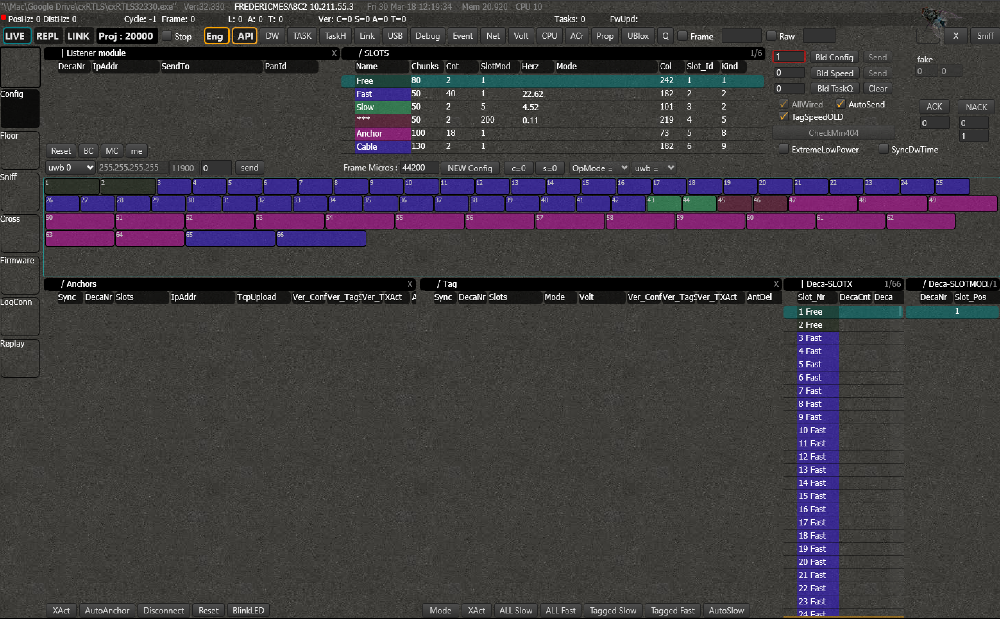
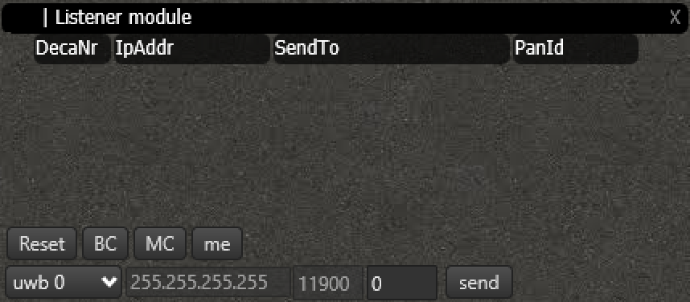
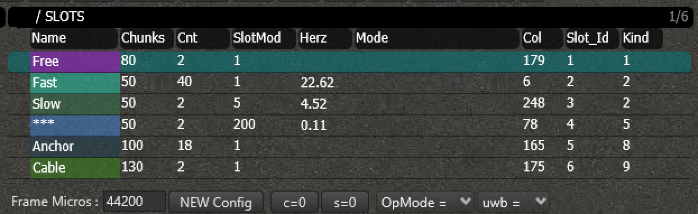
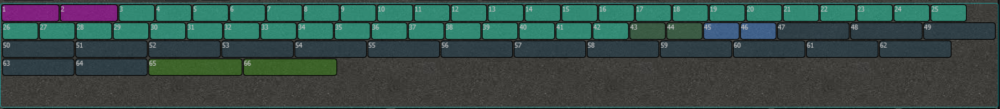
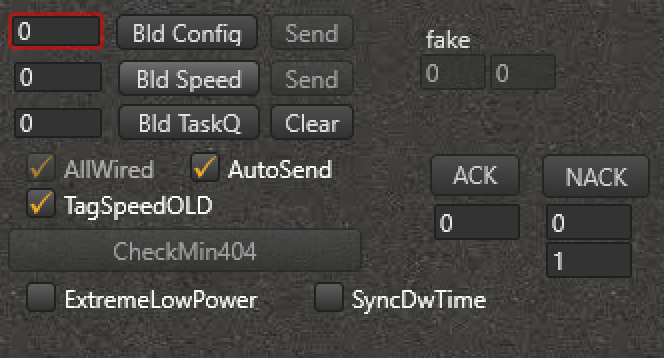

# Config
The configuration screen allows you to configure the most important timing parameters. You can choose the slots and update rate for the anchors and tags or let everything be configured automatically (this feature is coming). Also the parameters for the listeners are set here.

## Overview

1.timestamps
1.test2

## Listener Module
All the connected listeners will appear in this screen. You will see their node numbers and IP addresses, to which IP the listener is sending its data and on which panID/subnetwork it is listening.

You can reset each listener individually and change the destination IP address.
Having problems getting the listeners in? Have a look at the troubleshoot (hier link).

## Slots & Frames
Every second is subdivided into frames. During each frame, all of the nodes have a chance to send their data once. The size of the frames can be adjusted (more on that below), and the amount of frames that fit within a second determines the maximum update rate for the tags. The shorter the frame, the higher the update rate can be.

Each frame is subdivided into slots. You can assign a slot to each anchor and tag. This will determine when  they will send their data in time exactly (cfr. TDMA or Time Division Multiple Access).

There are multiple kind of slots. Three slotkinds are allocated for tags (Fast, Slow and \*\*\*), two are for anchors (Anchor & Cable). A tag cannot be put in an anchorslot and vice-versa.  Each slotkind has multiple editable parameters:
- Chunks - how long the slot is
- Count - how many of these slots are available in a frame
- SlotMod - how many tags or anchors can fit in this slot. Together with the framesize fully determines the updaterate of the node (shown in the column Hertz).
- Mode - extra parameter given to the node, available via the embedded api.

### Assigning slots
You can auto-assign the slots to the anchors and tags manually or automatically.
For the manual way, click on the tag or anchor you want, and keep pressing until you see XX. Then drag it into the slot you want. To make this automatic, click AutoAnchor. The anchor will then be assigned to the lowest possible slot.

### Update configuration
Whenever you are done configuring the nodes, press 'Bld Config' to send the configuration to the system. The number of the configuration is shown in the box left of the button. Whenever the system has successfully received the configuration, the box will turn green.

Whenever the updaterate of a tag is changed, press 'Bld Speed' instead.
