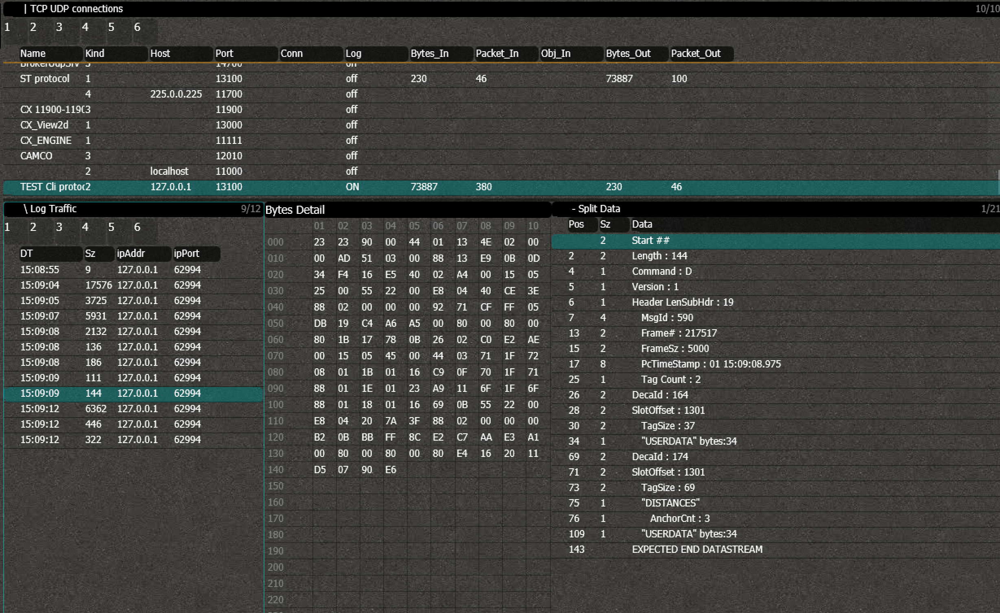
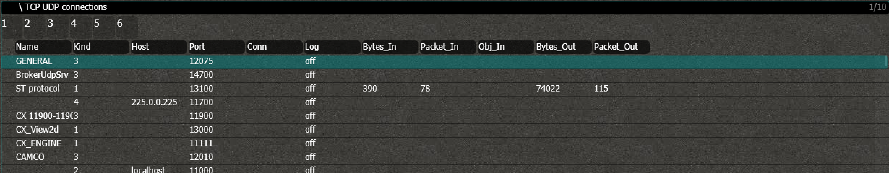
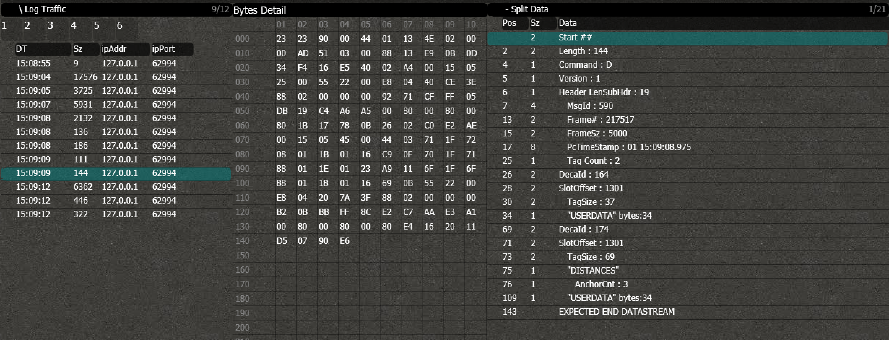

# LogConn
The LogConn screen enables you to log all the network connections and analyze all the recorded network messages.
You can see it as a LAN sniffer (such as WireShark) for all the RTLS traffic, with advanced functionality tailored to the RTLS application.

## Connections

## Packets
You can see all the packets that are logged, with all of their details.

### Packet Details
All the packets that meet the selected filtercriteria are shown in the left panel. Select one of the to see its contents.
### Packet Bytes
Have a glance on all the individual bytes of the packet in the middle panel. Perfect to debug communication with and from the program.
### Packet Parse
In the right panel, you can see a summary of the parsed data.
