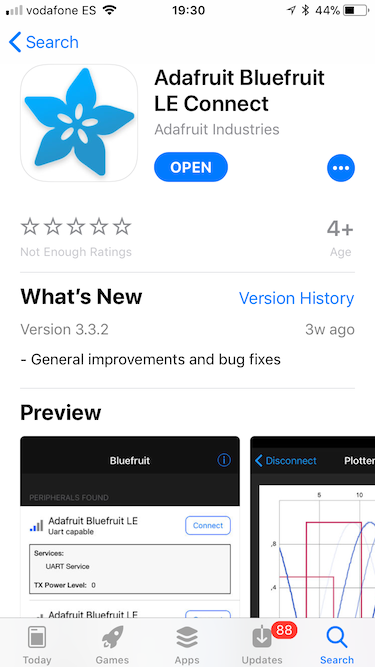
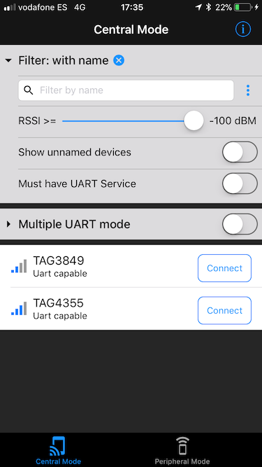
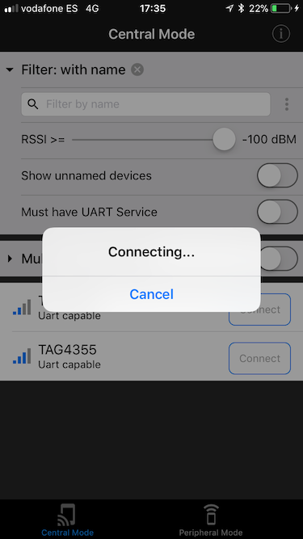
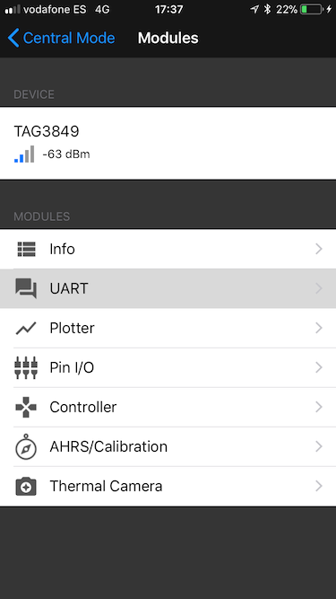
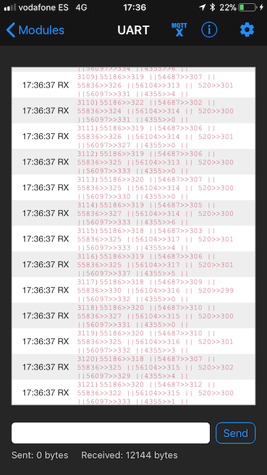
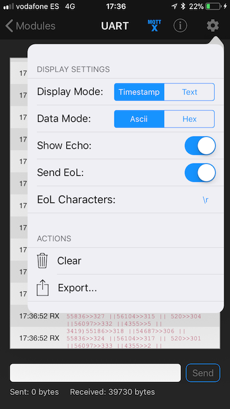
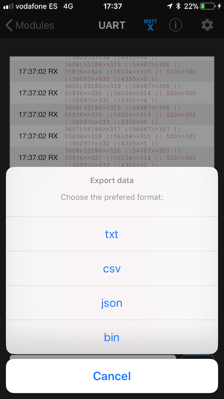

# BLE
Receive data from the mobile tags on your phone or tablet. This data is transmitted via a BLE connection. In order to make the connection and see the data, you will need to download an app that supports the correct BLE service.

## Some more details on BLE
Data is transmitted via BLE. BLE is not designed for high throughput of data, so we need to be careful with the amount of data we send. Some important concepts are the GAP Role and the GATT Profile with its services & characteristics.

### GAP Role (Central vs Peripheral)
We need to distinguish the so called GAP (generic access profile) role. There are 2 roles: central and peripheral. A Peripheral can advertise to let others know it's there. It can however not establish a connection. This is always done by a Central, which can send connection requests. You can see the Central as the master and the Peripheral as the slave.

In our system, the tag serves as peripheral and the phone/tablet with the app as central.
So in the app you can see all tags that are advertising in the neighborhood, and make connections with them. After making a connection, data can be exchanged.

### GATT
The GATT Profile is defined as follows:
```
The GATT Profile specifies the structure in which profile data is exchanged. This structure defines basic elements such as Services and Characteristics, used in a profile.
```
We need to have a service that allows us to exchange at least the distances (and possibly other data).

#### Nordic UART Service (NUS)
The NUS is a proprietary BLE service that mimics UART over Bluetooth. This means essentially that we can send any arrays of data up and down via the RX and TX datachannel.

You can send any kind of data, so we can send strings of readable text, or encode the data via a binary protocol.

#### Tailored Service (TODO)
In order to optimally make use of the BLE, we need to make a service especially made for this problem. This has not been done yet however, and until then we'll make use of the NUS. Whenever the custom service is ready, we will also need a custom app to display the data.

## BlueFruit
BlueFruit is a free app from Adafruit, available on iOS and android, that supports the NUS. Search for 'BlueFruit' in the appstore or the google store and download the app.



### Make a connection
When you open the app, it will have the correct predefined settings. The app is set in Central mode, and it will show all Peripherals (in other words: the tags) that are advertising the UART service. Whenever you have some tags running, you should see something like this:



If you don't see the tags, try to reset the tag and/or the Bluetooth connection on your phone/tablet.

Now press connect on the tag of choice. It will show you the following:





`Note:` we will only make use of the UART module of this app. You can ignore the other modules.

### Receiving data
After pressing 'UART', you will see a console with data coming in (and out if you want to send something to the tag).
The data is shown in ASCII-format so that it's readable. Each dataframe has the following format (for now.. it sucks and will be changed soon with a binary format :). ):
```
[framenumber]) [tagid1] >> [distance1] || [tagid2] >> [distance2] || ...
```
The distances are in centimeter and represent the measured distance between the tag you made the BLE connection with and the tag with ID shown before the '>>'



In the screenshot you see a how it can look like when a tag is ranging with 7 other tags.


### Exporting data
BlueFruit has the nice feature that you can export the data. Press the gear in the right upper corner to show the settings menu.



When you press 'Export', you will see the different supported formats: `txt`, `csv`, `json` and `bin`.




## Conclusion
BLE gives us way to send the data (distances) from the tags to other devices such as phones and tablets.
With BlueFruit we can quickly demonstrate and export the distances. In the near future this will be replaced by a custom service and app.
