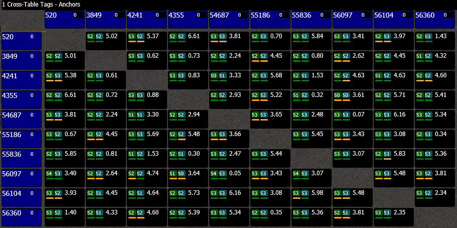

# Listener & RTLS Manager <Badge text="Advanced" type="warning"/>
The Network Listener enables all the advanced features of the system.
You can read out all the distances from all the tags that are in UWB range, see signal quality figures, debug timing, adhoc settings and much more.

## How it works
The *Listener* is another kind of node that we can add to the system. It is continuously listening (hence the name) to UWB data in the air, will filter and accumulate all relevant information and finally send this to the PC.
Because there can be a lot of data, the connection between sniffer & PC is done with an ethernet connection.

The PC software is called `RTLS Manager`. It will capture and decode the information it receives from the listener (or multiple listeners). The software contains many features to make the Black Magic that RF/UWB sometimes is more tangible. It also serves as the central data hub.

`Note:` the Listener is not a default node in an Adhoc Ranging system. If you want to make use of it, contact us.

## Cross
The *Cross* is a feature that shows all measured distances in a CrossTable.

One tag measures a distance to another tag and vice versa. Both distances are shown in the cross.

You can see a video of the Cross in action [here](https://drive.google.com/open?id=1D0itG6m7sKs-gR6QPtMNuwNh1J57_Hg0).

::: tip Note    
You will need a google account that has access to the file on the drive.
:::