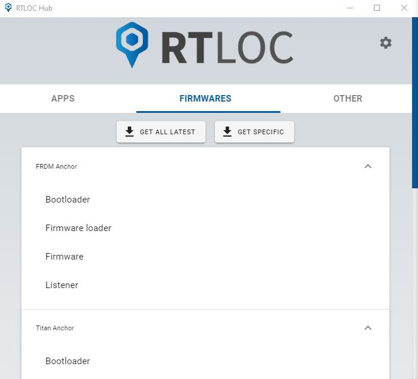

# Firmware management
You can manage your firmwares in the *Firmwares* screen.
Currently, you can:
  - Get and remove firmwares for different platforms, in different versions
  - Flash these firmwares from the app

