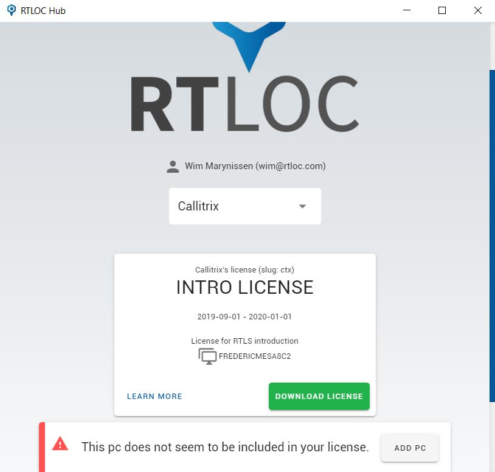

# License management

From the Desktop app, after logging in, you can view your license(s) in the account section. To be able to use a license, you will need to **add your current PC** to the license ("add PC").
Then, download the license. It should be placed in the correct folder (*C:/CxRtls*) for the Engine app to recognize it. 

<!-- :::tip 
  NOTE: To view the license you first need to login through the Desktop app.
::: -->

