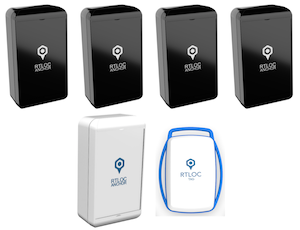
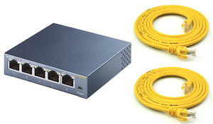
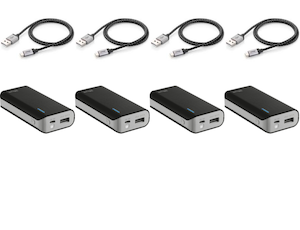

# Install the RTLOC System
You will find help on how to install an RTLOC Positioning System on these pages.
We talk about good practices when placing your anchors and more.

1. [Getting Started](/install/getting_started.html)
2. [First localization](/install/firststeps.html)
3. [Anchor Placement](/install/anchor_placement.html)

## Minimum Requirements
You will need at least the following hardware:


### Positioning devices
```
  - 4 anchors
  - 1 listener anchor
  - 1 Tag
```
  

### Networking equipment
```
  - 1 Switch
  - 2 Ethernet cables
```


### Power supplies
```
  - 4 Micro usb cables (type B) and batteries
  - PoE
```
  

### Other
```
 - Computer (desktop/laptop/tablet), preferably Windows OS
```


# What's next

<!-- * Perform some initial checks -->
* Setup [finetuning](/install/tuning.html)
* Follow our [system guide](/guide/)
* Integrating with [our API](/api/)
