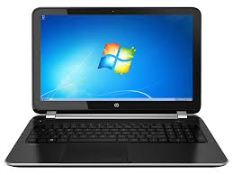

# RTLS introduction

As an introduction to ultra-wideband RTLS, we start with a few anchors and tags which will be auto positioned.

## Minimal requirements
Before you get started, make sure you have at least the following hardware:
:::warning NOTE:
  If you have bought the `RTLS Introduction Kit`, everything will be included to get started. You can however also use RTLS devices which you may already have (e.g. from Decawave's MDEK kit) if we support them.
:::

### Positioning devices
  - 4 anchors
  - 1 listener anchor
  - 1 Tag

### Networking equipment
  - 1 Switch
  - 2 Ethernet cables

### Power supplies
  - 4 Micro usb cables (type B) and batteries or socket adapters
  - PoE

  

### Other
A computer (desktop/laptop/tablet), preferably Windows OS

## Getting Started
If you are using RTLS introduction kit, the devices should already have the necessary firmware. If your tags are not flashed with the Adhoc Firmware, you will have to do that manually. Take a look at our guide of [hardware flashing](/hardware/flashing/hw_flashing.html).

Although not required, it can be convenient to download our app at **[https://cloud.rtloc.com/download]**.

Follow these steps:

1. Power all devices over USB (using a power adapter or a battery)

2. Open the web portal from the RTLOC app or via [https://cloud.rtloc.com/ble](https://cloud.rtloc.com/ble) and press the Bluetooth icon, select "Connect to device"

3. Select the initiator device, called *INITxxx*. A Bluetooth connection is now being made. If successful, you should see some device information in the bluetooth page of our portal app.

4. Open the "visualize" tab and press the "autoposition" button. The anchor XYZ coordinates are now being measured. You should be able to track the auto positioning progress.

5. Check if the anchor positions match your configuration. You should be able to see your tags if any are active.

### More details on BLE
Bluetooth Low Energy gives us the possibility to read out the data (distances) on any phone/tablet/... that supports BLE4.0 (basically any recent device).
More information [here](/hardware/hw_interface_ble.html).

### Other interfaces
In order to get data out of the system, we somehow need to interface with the tags. Other connection methods (apart from BLE):
- BLE (wireless)
- USB (wired)
- Network Sniffer (advanced)

## What's next?
You can connect your own app to the device BLE interface and use the RTLS data. Check out the [BLE API details](api/api_ble) for BLE development.

It is also possible to access a real-time stream of position- and sensordata. We provide data in binary and JSON format, over UDP, TCP, websocket or MQTT. To do this, you will need a license for our professional setup. This also includes professional UWB debugging tools on the desktop.
