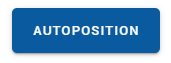

# Basic Positioning
If you're new to RTLS or if the problem you're trying to solve is relatively easy, our `Basic Positioning` solution offers everything you need to quickly get started.
The most important characteristics of this system are the following:
 - Fully wireless setup. No need to connect hardware to the computer, install drivers, ...
 - Readout of all the data via BLE
 - Autopositioning of the anchors 

This solution is tailored to get you started as quickly as possible with a limited amount of tags (12) and anchors (8).

## Minimal requirements
:::warning NOTE:
  If you have bought the `Starterskit`, everything is included in the box to get started and the hardware is preflashed.
  You can skip ahead to the [Getting Started](/install/basic_positioning_getting_started.html#getting-started) section.

  If you bought a starters license to use on your own hardware from other vendors you already owned (e.g. if you bought Decawaves MDEK kit), you can continue reading here.
:::

Before you get started, make sure you have at least the following hardware:
 - 4 or more anchors with power supply
 - 1 or more tags with power supply
 - A computer (desktop or laptop) with bluetooth support and Google Chrome.

 Please refer to our [list of supported tags and anchors](hardware/hw_boards.html).

### Flashing the boards
In order to make use of our system, we need to flash the correct firmware on the boards.
This can be done via the [RTHub](/hub/firmware.html) PC app.

## Getting Started
If you are using RTLS introduction kit, the devices should already have the necessary firmware. If your tags are not flashed with the Adhoc Firmware, you will have to do that manually. Take a look at our guide of [hardware flashing](/hardware/flashing/hw_flashing.html).

Although not required, it can be convenient to download our app at **[https://cloud.rtloc.com/download]**.

Follow these steps:

1. **Power** all devices over USB (using a power adapter or a battery)

2. Open the **portal app** from the RTLOC app or via [https://cloud.rtloc.com/ble](https://cloud.rtloc.com/ble). Log in using your account, or create one if you haven't already.

3. Optionally, create an RTLS "project". This is not a hard requirement for these first steps.

4. Press the **Bluetooth** icon and select "Connect to device". Connect to the initiator device, called *INITxxx*. A Bluetooth connection is now being made. If successful, you should see some device information in the bluetooth page of our portal app.

5. Open the "visualize" tab and press the **autoposition** button. The anchor XYZ coordinates are now being measured. You should be able to track the auto positioning progress.

6. Check out the resulting **data**. Check if the anchor positions match your configuration. You should be able to see your tags if any are active.

<!-- TODO: screenshot of visualization -->

### More details on BLE
Bluetooth Low Energy gives us the possibility to read out the data (distances) on any device which supports BLE4.0 (basically any recent device).
More information can be found [here](/hardware/hw_interface_ble.html).

## 3. What's next?
You can connect your own app to the device BLE interface and use the RTLS data. Check out the [BLE API details](api/api_ble) for BLE development.

It is also possible to access a real-time stream of position- and sensordata. We provide data in binary and JSON format, over UDP, TCP, websocket or MQTT. To do this, you will need a license for our professional setup. This also includes professional UWB debugging tools on the desktop.
