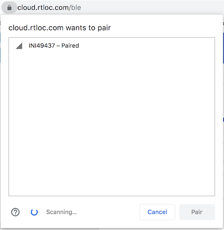
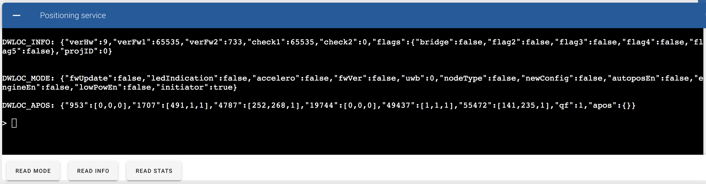
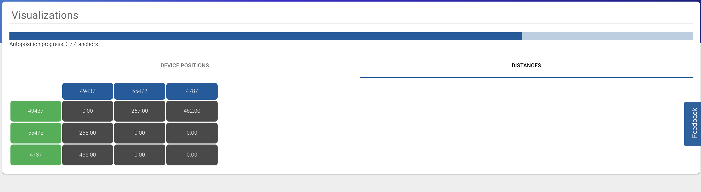
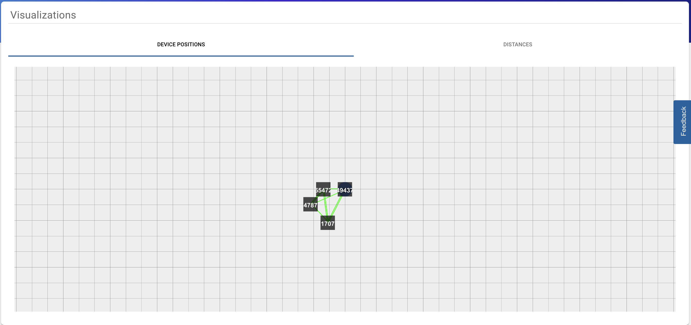
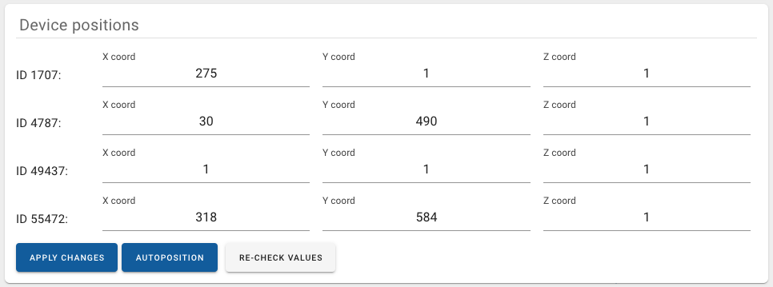
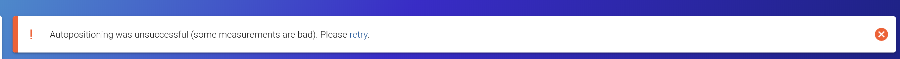
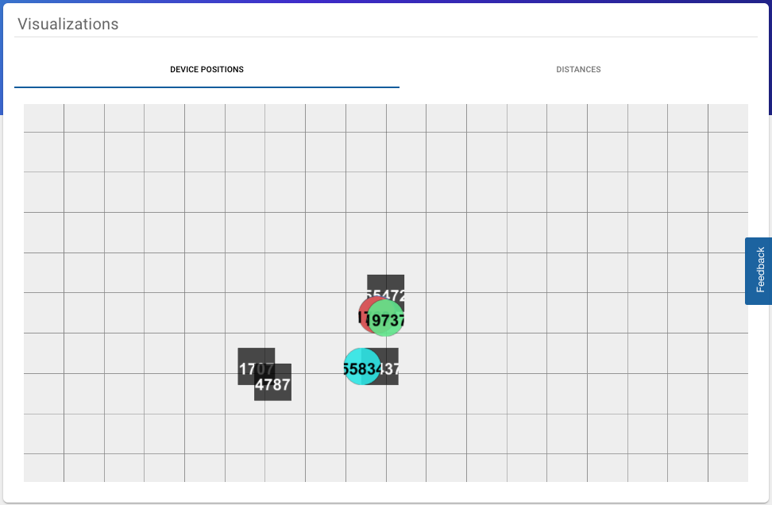

# Setup your first system
Although not required, it can be convenient to download RTHub  on [https://cloud.rtloc.com/download](https://cloud.rtloc.com/download).

## Login on the Portal
Before turning to the hardware, you need to make sure you have an account with which you can login. Open the **portal app** from RTHub or via [https://cloud.rtloc.com/ble](https://cloud.rtloc.com/ble). Log in using your account, or create one if you haven't already.

Optionally, create an RTLS "Project". This is not a hard requirement for these first steps.

::: tip
Most browsers should be supported, though recent chromium-based browsers are your safest bet.
:::

## Device firmware
First make sure the UWB RTLS devices (tags and anchors) have the necessary firmwares. We will need 4+ anchors, 1+ tags and one initiator anchor.
::: tip
If you are using starterskit, the devices should already have the necessary firmware. In case you want to update the firmware on the tags (or switch to Distance Tracking). Take a look at our guide of [hardware flashing](/hardware/flashing/hw_flashing.html).
:::

## Anchors
First we take care of the anchors. There is one special anchor called the `Initiator`. This is the anchor that regulates the system. You will communicate via Bluetooth with this anchor, so make sure you can get close to that anchor with your computer.

The anchors are marked with the label "A" and their ID below. 

  1. **Power** all devices over USB (using a power adapter or a battery)
  
  2. Hang the anchors in a good place. Make sure there is an anchor in each quadrant. More information on good practices on anchor placement can be found [here](/install/anchor_placement.html#_1-anchor-in-each-quadrant).
  
  3. Press the **Bluetooth** icon and select `Connect to device`. 
  
  

  Click on the initiator device, called *INITxxx* and press "Pair".
  
  

  A Bluetooth connection is now being made. If successful, you should see some device information in the bluetooth page of our portal app. You should see something like this:

  

  If you are not in the BLE specific page, you can always go there by pressing the **Bluetooth** icon and then `BLE device info`
  

When all these steps are done, we can continue with calculating where the anchors are hung. We do this by __autopositioning__ the anchors. They will try to figure out their relative positions automatically. 

  4. Open the "visualize" tab and press the **autoposition** button (make sure all tags are off). The anchor XYZ coordinates are now being measured. 

You can track the progress of the algorithm live. You will see distances being measured between the anchors.

Once the algorithm is done, the view will automatically switch to visualise the anchors. You can check if these positions correspond to where you have placed your anchors.

You can also see the coordinates of the anchors in the _Configure_ screen.

If something went wrong during the autopositioning algorithm, you will get notified to try it again.

If you don't manage to get good anchor coordinates, please refer to the [troubleshoot section](/install/basic_positioning_getting_started.html#autopos-keeps-failing) below.

## Tags
Now that all anchor stuff is done, we can focus on the tags. The tags are labeled with the letter "T", with their ID below.
The only thing you have to do is power the tag up. After a couple of seconds, the positions of the tag are coming in and all active tags are visualised.

<!-- TODO: screenshot of visualization -->

## Troubleshoot
### Lost BLE Connection
If you lost the connection with the anchor for some reason, it should reconnect automatically.
If this isn't the case, refresh the page and try to connect again.

### Autopos keeps failing
There could be multiple reasons for the autopos to fail. Keep the following rules in mind:
 - all anchors should have visibility on each other
 - Try to put the anchors on more or less the same height
 - Make sure all tags are switched **off**
 - Make sure all anchors are switched **on**

### I don't see one of my tags
If you are sure your tag has power, try resetting the tag. Also make sure it is in the vicinity of the anchors and it has clear sight on at least 3 anchors.

[TODO]

## What's next?
You can connect your own app to the device BLE interface and use the RTLS data. Check out the [BLE API details](api/api_ble) for BLE development.

It is also possible to access a real-time stream of position- and sensordata. We provide data in binary and JSON format, over UDP, TCP, websocket or MQTT. To do this, you will need a license for our professional setup. This also includes professional UWB debugging tools on the desktop.
