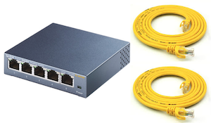
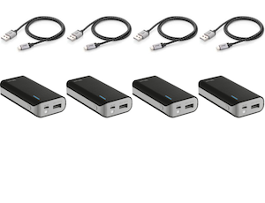
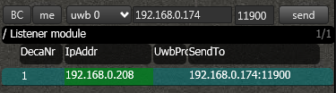
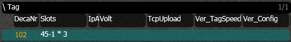

# Getting started With RTLOC

## Introduction
In this guide we will go through the setup of the RTLOC positioning system. You will learn some of the basics of the system and get familiar with some of the features.
You will end up having a fully functional RTLS system and you can start tracking your first objects. Hooray!

## Basic requirements
Before you get started, make sure you have at least the following hardware:

### Positioning devices


```
  - 4 anchors
  - 1 listener anchor
  - 1 Tag
```

### Networking equipment


```
  - 1 Switch
  - 2 Ethernet cables
```

### Power supplies
  

```
  - 4 Micro usb cables (type B) and batteries
  - PoE
```

### Other


```
 - Computer (desktop/laptop/tablet), preferably Windows OS
```

:::warning NOTE:
 If you have bought the `Introduction Kit`, everything will be included to get started.
:::

## Connect the Hardware
Let's apply power to the hardware (_HW_) to spark some life into it. There are multiple ways to power the HW. Click [here](LINK) for more information. The easiest way to get started is to power the boards via the usb cables.

Once the boards have juice, you should see some lights blinking. There are a couple of [patters](/reference/leds.html) possible. If all is going well, you should see a green light blinking on all boards.

The last step before we turn to the PC is to connect the listener and one anchor to the same network as your PC. You can use the switch for this. The lights on the ethernet plug will start blinking.

Place the anchors in a strategic way. Hang them around the area you want to track. Make sure they are placed so that they are not blocked by big objects (especially metal). You can find some more hints on how to hang the anchors [here](LINK).

## Setup the PC software (cxRTLS)
Locate the PC software and start it by double clicking the icon.


You will get welcomed in the PC software.

:::warning
The software will run in a limited demo-mode without proper license.
[Here's some help](/cxRTLS/cxRTLS_license.html) on how to activate your license.
:::

### Listener(s)
First we will make sure the listener is properly initiated. Go the the screen  'Floor' in which you will see the _Listener Module_. All the connected listeners are listed here. It will show you to which IP address it is sending its data (this can be unicast, multicast or broadcast), together with the port.



Make sure you see the IP-address of your PC in the column _SendTo_, and the IP-address of the listener is colored green.

### Anchors & Tags
Now let's setup the anchors and the tags. You should see the anchor that is connected to the ethernet appear in the Anchor list.

By pressing _AutoSetup_, the system will automatically be set up and you won't have to bother about the details. Wait for about 15 seconds after pressing the button. You will see the green IP turn red for a short moment.
All the anchors & tags that are powered on will start to appear in the list.




Whenever all is is right, the numbers in the column DecaNr should turn right. This means data of these nodes is received.

### Floorplan
Now let's turn to visualising the data. Press the screen 'Floor'. 

#### Anchor Coordinates
Before we can track the tags, we need to know where the anchors are. 
You can calculate their (relative) positions automatically by pressing _AutoPos_. 
After a short while, you will see the anchors move to their position and you are ready to calculate your first tag positions.
Find more information on the anchor coordinates [here](/install/anchor_placement.html).

#### Engine
Make sure that the internal engine is switched on. You can find the engine menu in the Action Bar. Whenever the engine is running, the engine menu button looks like this: 


Whenever it is switched of, it will looks like this: 


Click on it to open the menu:


Unselect "Skip Engine" to activate the engine.

Walk around with your tag and check that the tag is actually moving on the screen.

## What's next?
You have just set up an easy RTLS system. Congratulations! Now there are several things you can do. Extend the area of intrest by adding more anchors. Follow more objects by adding more tags. Reach the highest possible accuracy by calibrating your system. Consult the API documentation to find out how you can connect your own system to RTLOC. There's a lot to discover. A whole new world of possibilities is waiting for you.

* Setup [finetuning](/install/tuning.html)
* Follow our [system guide](/guide/)
* Integrating with [our API](/api/)
