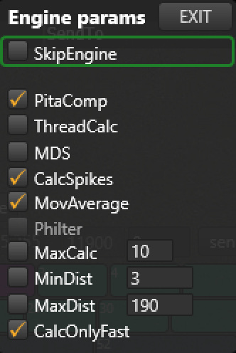

Now let's turn to visualising the data. Press the screen 'Floor'. Before we can see where the tags are, we need to know where the anchors are. You can calculate their (relative) positions automatically by pressing AutoPos. After a short while, you will see the anchors move to their position and you are ready to calculate your first tag positions.
Make sure that the internal engine is switched on. You can find the engine menu in the Action Bar. Whenever the engine is running, the engine menu button looks like this: . Whenever it is switched of, it will looks like this: . Click on it to open the menu:

Unselect "Skip Engine" to activate the engine.
Walk around with your tag and check that the tag is actually moving on the screen.