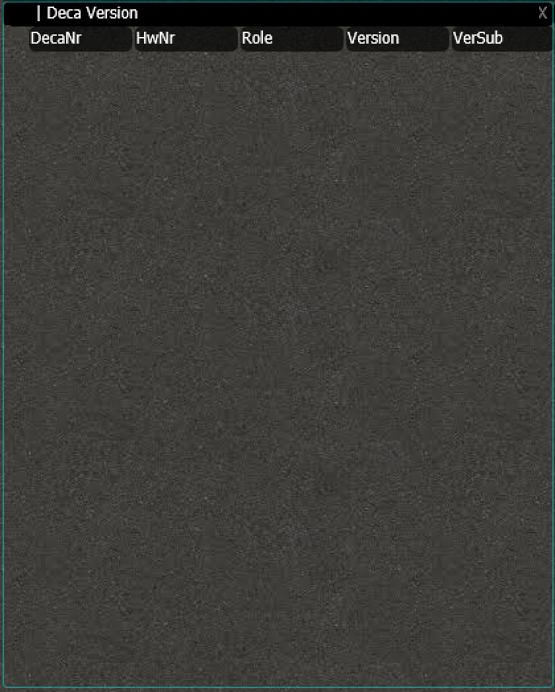
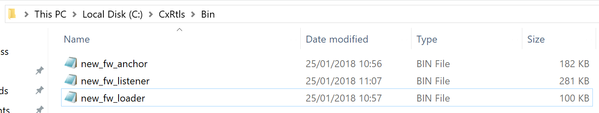
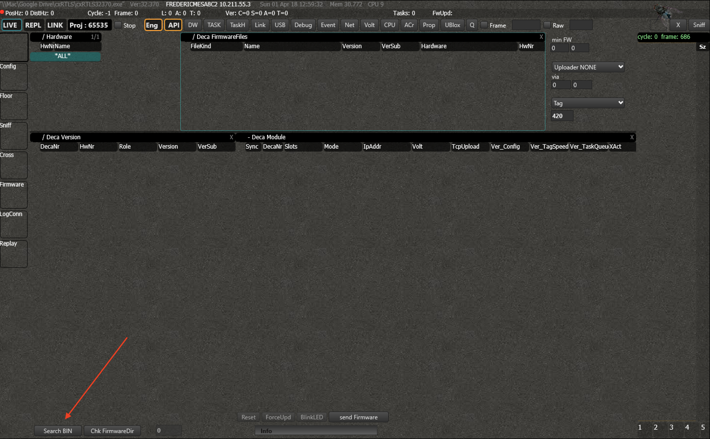
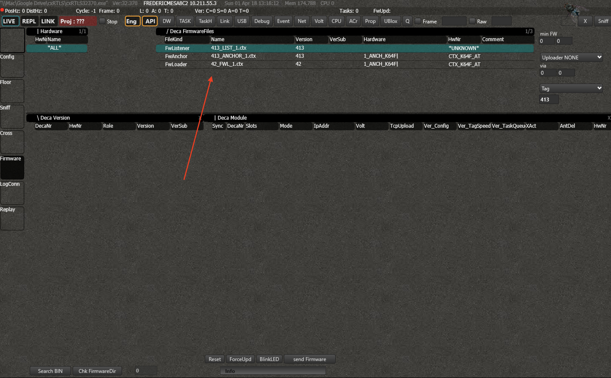
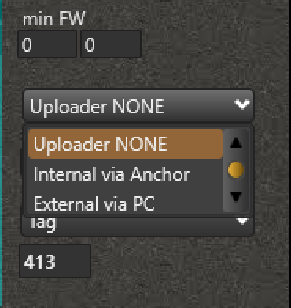
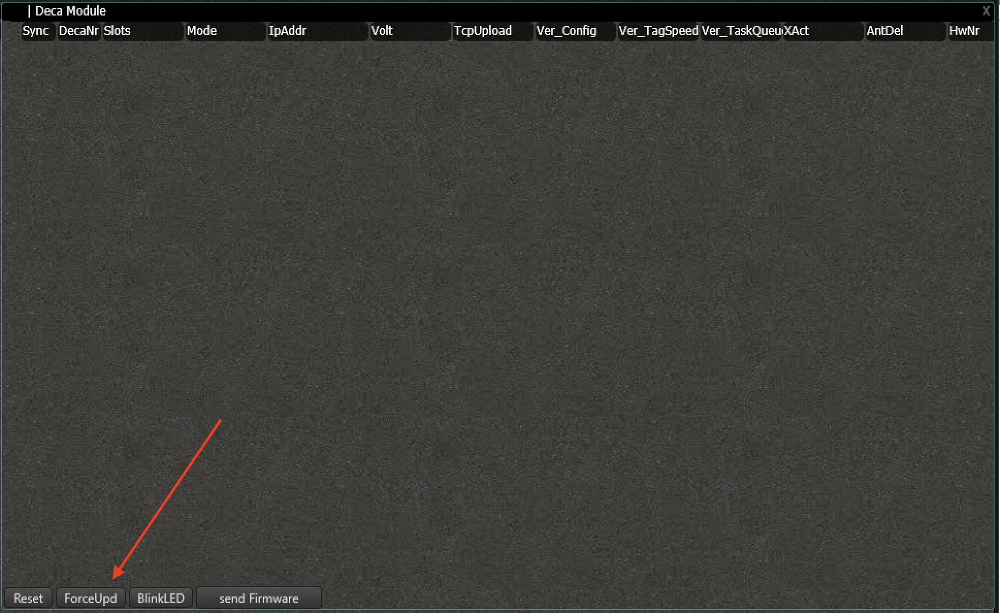
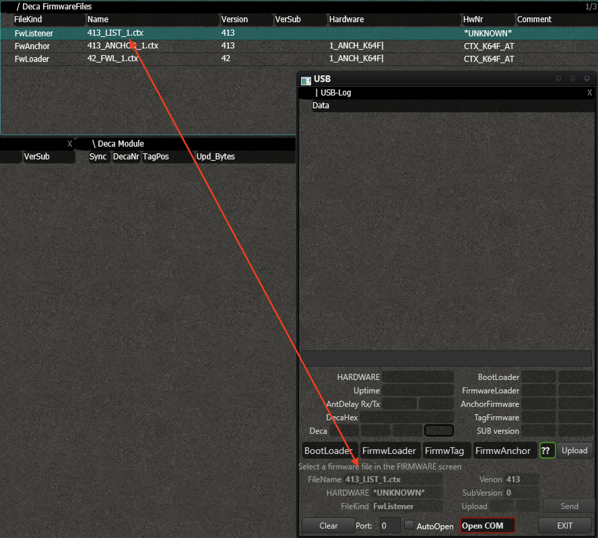
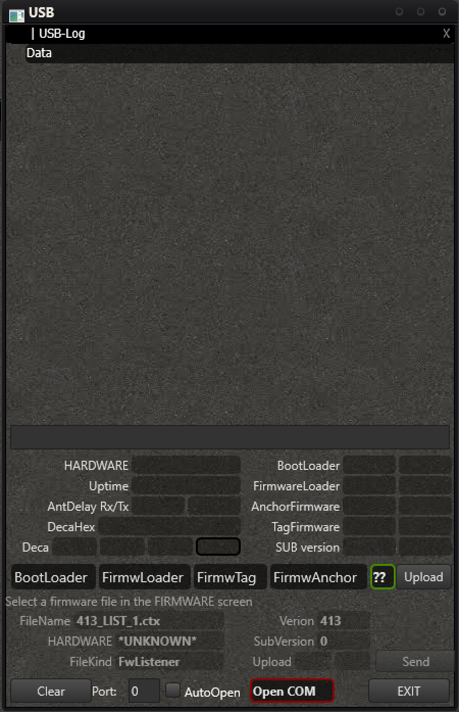

# Firmware Update
Whenever a new firmware is released or when you built your own with the DevKit, there are multiple ways to deploy that firmware to the system.
In this document you can learn how to install the version you want on your system.

## 1. Verify the version
In the panel _'Deca Version'_, you can verify the current version of all the tags and anchors.
The version will appear here once the system has received the information from the node. This will happen automatically. Keep in mind however that after booting the cxRTLS, it might take some time before all the information is collected (approx. 1 min).


## 2. Import FWs in cxRTLS
Before you can update a node, you need to import the firmware in cxRTLS. Doing this is easy. First drag and drop the binary you want into the following directory:
```
c:\cxRTLS\bin\
```
The name of the file doesn't matter. You can drag in any type (tag, anchor, listener or fwloader) of firmware into this directory, the software will handle.


After doing this, press _'Search Bin'_ in the lower left corner of the screen.


Upon pressing the button, the firmwares will be imported in the system. You can verify the details in the _'Firmwarefiles'_ panel.



## 3. Update the Nodes
Whenever your system is all set up and running, the easiest way is to perform an Over-The-Air (OTA) update. Everything can be done from within cxRTLS and no physical interactions are required. You can also update individual nodes by connecting it to the computer with a USB cable. In case you have a board that has never been flashed before or if you want to update the bootloader, you can use a programmer and the provided scripts.

### 3.1. OTA System
The OTA system consists of 2 steps. First you need to force the nodes you want into update mode. Then you can update it with the firmware of choice.
> `Note:` The _'min FW'_ in the upper right corner will determine the minimum required version for anchor- and tagfw to load on the nodes. If these numbers are different from zero, you can only send versions that are equal or higher. This way you can prevent sending incompatible versions to the nodes.

#### 3.1.1 Put the node in FW Update mode
First you need to select the firmware you want to update the node with in the _'Firmwarefiles'_ panel.
You will also need to select the method of transfer.


The `Internal` method is faster, but has the limitation that only the firmware that is available on the wired anchor can be used.
With the `External` method you can send any firmware you want to the node.


Now select the node you want to update in the _'Deca Module'_ panel and press _'ForceUpd'_ .


The node will exit the current firmware it is running and jump to its firmwareloader.

#### 3.1.2 Update of the FW & Tracking the progress
The update will start immediately. The progress of all the individual nodes can be tracked in the '_Deca Module'_ panel. A loading bar will appear under the column _'UpdBytes'_. You can see which how many and which parts are still missing.

You can repeat the process for any of the nodes you want to update.
You don't have to wait for other nodes to be finished to start other updates.

### 3.2 OTA local (under development)
This method will make it possible to connect an anchor via USB to your host and update all other nodes wirelessly. This will happen without the need for a listener and a network connection to your anchor will not be required.

### 3.3 USB
If you don't have any infrastructure available or you miss a TCP connection to your anchor(s), the USB firmware update might help you out.
Connect the node you want to update via a USB cable to the host computer and [open the connection](HIERNOGLINK).
Force the node into BootLoader by pressing on _'BootLoader'_. Select the firmware you want to upload in the Firmwarescreen. The selected FW will appear in the USB window.


Press _'Send'_ to start the upload. The progressbar of the update will appear.


When the update is done, the node will automatically boot its new FW.

### 3.4 Programmer
Connect the programmer of choice (J-Link Segger or different) to the JTAG header of the node.
If you have access to the ctx_taglib, you can find the scripts in:
```
PATH_TO_LIB/ctx_taglib/scripts/
```
...
[Click here](LINKREQUIRED) for more information on setting up the toolchain.
