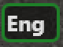

# Getting Started - Basics
## Introduction
In this guide we will go through the setup of the RTLOC positioning system. You will learn some of the basics of the system and get familiar with some of the features. You will end up having a fully functional RTLS system and you can start tracking your first objects. Hooray!

## What do I need?
You will need at least the following hardware:

- 1 Listener
- 3 Anchors
- 1 Tag
- 1 Switch
- 4 Micro usb cables (type B)
- 2 Ethernet cables
If you have bought the Introduction Kit, everything will be included to get started.

## Connect the Hardware
Let's apply power to the hardware (HW) to spark some life into it. There are multiple ways to power the HW. Click here [LINK] for more information. The easiest way to get started is to power the boards via the usb cables.
Once the boards have juice, you should see some lights blinking. There are a couple of patters possible. If all is going well, you should see a green light blinking on all boards.
The last step before we turn to the PC is to connect the listener and one anchor to the same LAN as your computer. You can use the switch for this. The lights on the ethernet plug will start blinking.
Place the anchors in a strategic way. Hang them around the area you want to track. Make sure they are placed so that they are not blocked by big objects (especially metal). You can find some more hints on how to hang the anchors here [LINK].

## Setup the PC software (cxRTLS)
Locate the PC software and run it by double clicking the icon.

getting_started-setup_icon.png

After having loaded, the software will welcome you in the startup screen.
Note that without a valid license, the features of the program will be limited.
[Click here](cxRTLS_license.html) if you need more information on or help with the licenses.

## Listener(s)
First we will make sure the listener is properly initiated. Go the the screen 'Floor' in which you will see the Listener Module. All the connected listeners are listed here. It will show you to which IP address it is sending its data (this can be unicast, multicast or broadcast), together with the port.

getting_started-listener2.png

Make sure you see the IP-address of your PC in the column SendTo, and the IP-address of the listener is colored green.
If you are having problems getting the listener into the system, please click [here](troubleshoot_enet.html) to go to the troubleshoot.
## Anchors & Tags
Now let's setup the anchors and the tags. You should see the anchor that is connected to the LAN appear in the Anchor list.

By pressing AutoSetup, the system will automatically be set up and you won't have to bother about the details. Wait for about 15 seconds after pressing the button. You will see the green IP turn red for a short moment. All the anchors & tags that are powered on will start to appear in the list.

getting_started-tags.png

getting_started-anchors.png

Whenever all is right, the numbers in the column DecaNr should turn right. This means data of these nodes is received.

## Floorplan
Now let's turn to visualising the data. Press the screen 'Floor'. Before we can see where the tags are, we need to know where the anchors are. You can calculate their (relative) positions automatically by pressing AutoPos. After a short while, you will see the anchors move to their position and you are ready to calculate your first tag positions.
Make sure that the internal engine is switched on. You can find the engine menu in the Action Bar. Whenever the engine is running, the engine menu button looks like this: . Whenever it is switched of, it will looks like this: . Click on it to open the menu:

Unselect "Skip Engine" to activate the engine.
Walk around with your tag and check that the tag is actually moving on the screen.

## What's next?
You have just set up an easy RTLS system. Congratulations! Now there are several things you can do. Extend the area of interest by adding more anchors. Follow more objects by adding more tags. Reach the highest possible accuracy by calibrating your system. Consult the API documentation to find out how you can connect your own system to RTLOC. There's a lot to discover. A whole new world of possibilities is waiting for you.
