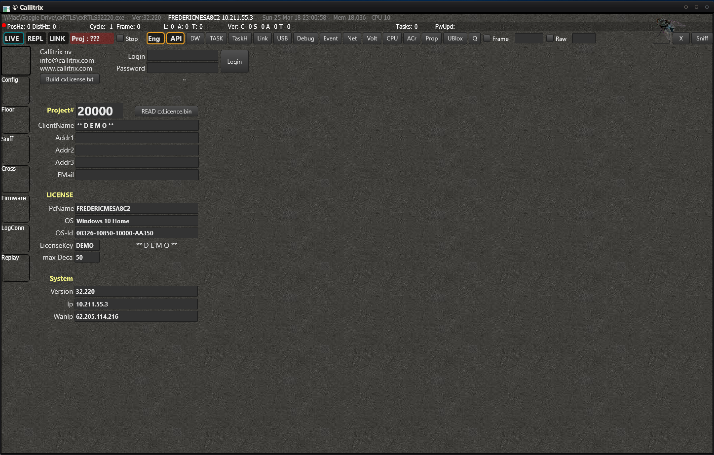

# RTManager

RTManager (former *cxRTLS*) is our main (desktop) program/engine. You can configure, manage and analyze the full system with it.
It is designed to be as efficient as possible when it comes to memory consumption and CPU usage, without compromising on performance.
It runs on Windows 7 or later versions and requires around 30MB of storage.

## Installation
An easy way to install the app to your desktop is through the Hub's [app management](https://docs.rtloc.com/hub/apps.html) screen. Alternatively, you can install the executable manually.

## Getting started
When you open the program, you will see something similar:

Follow the [getting started](/positioning/positioning_getting_started.html) steps to kickstart your first RTLS project
