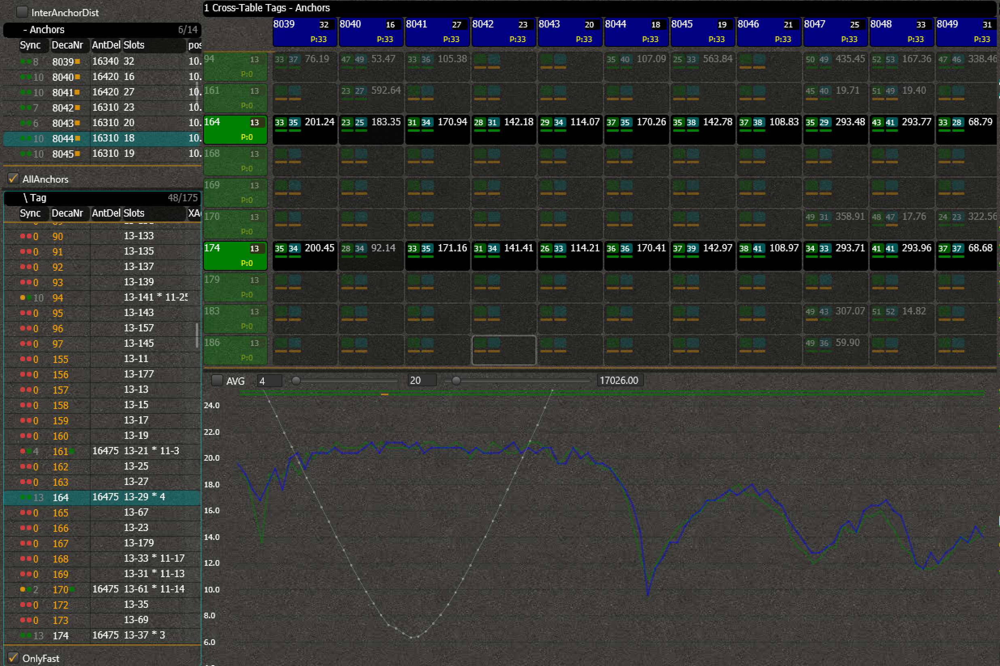
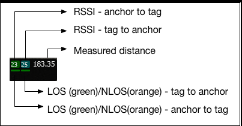
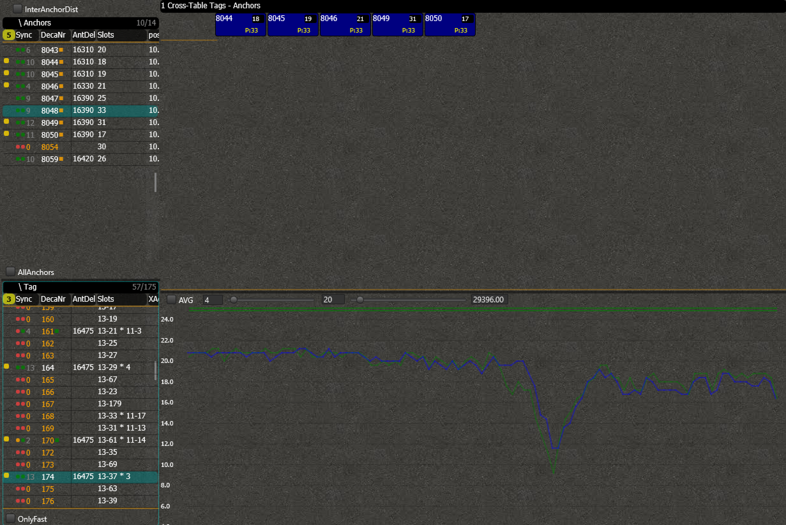
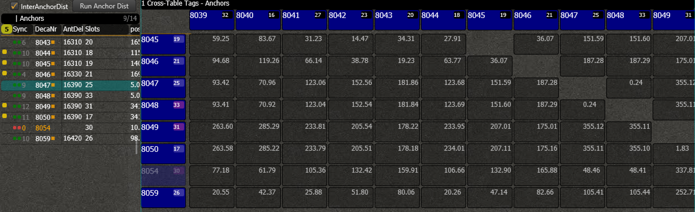

# Cross
The Cross screen gives you an overview of all measured distances between tags and anchors, and between anchors and anchors.
## Tag-AnchorDist
By default, the cross table will display all anchors and all tags that are selected as fast.

If not all anchors/tags fit on the screen, click on one of the squares and move your arrow down/right to scroll through the table.

Every anchor-tag relation will show you a couple of measures.

Toggle off the checkboxes _'AllAnchors'_ and/or _'OnlyFast'_ if you want to make a custom selection.
Click in the first column of the anchor/tag if you want to enable it in the cross. A yellow circle will appear in front of it when it is selected.

## InterAnchorDist
By toggling the _'InterAnchorDist'_ -checkbox, you can switch to the measurements between all the anchors.

If you have entered the exact coordinates of the anchors, the interdistances are shown.
Now you can measure the distances between the anchors by clicking on _'Run Anchor Dist'_. All the anchors will start to range with each other. This process can take a while, depending on how many anchors you have (about 10 seconds per anchor).
If not all anchors have visibility to each other, the table might have some open spots.

<!-- NOG MAKEN: -->
<!--  -->
