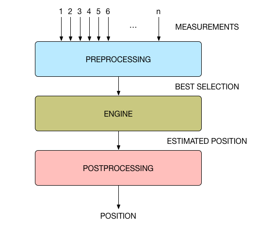
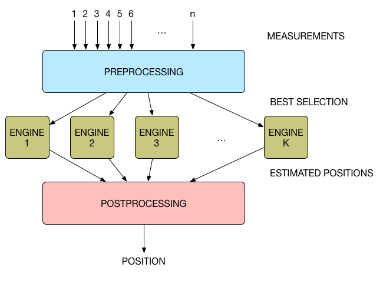

# Engine
The engine is a set of algorithms that convert a data set into a position of the tag. This data set can be distances between a tag and multiple anchors (TWR) or differences of the time of arrival of tagsignals on the anchors.

## Internal or External?
The engine can run on different places. Where exactly will depend on the situation.

### On the boards
If you choose to run the system in one of the inverse modes ([TDOA2](/reference/algorithms.html#tdoa2) or [TWR2](/reference/algorithms.html#twr2)), the engine will run on the tags so that each tag can calculate its own position.
For low-end systems (not too many anchors and tags), the engine can also run on one of the anchors when in one of the normal modes.

### Internal Engine 
As soon as the amount of anchors and tags grows however, the calculation power of the anchor will not be sufficient (since it also has to do many other tasks). In that case we will switch to running the engine on the PC.
Here it can run from within the data collection program (Engine).

### External Engine
You can also implement your own positioning engine. Such an external engine preferably runs within the same network and connect to Engine via a UDP connection. The raw data is then distributed over all connected external engines, crunched and forged into positions and (optionally) fed back to Engine.

## Mathematics
The RTLOC engine supports two localization techniques: trilateration and multilateration.

:::tip Note
We have some descriptions and a comparison of the algorithms [here](/reference/algorithms.html).
:::

### Trilateration
Trilateration offers a solution for TWR problems. When you have a set of distances from tag to multiple anchors, the trilateration algorithm calculates the position of the tag from these distances.

### Multilateration
Multilateration offers a solution for the TDOA problem. You have Time Difference of Arrivals as input. These can be mapped on hyperbolas. The position of the tag is at the intersection of these hyperbolas.
