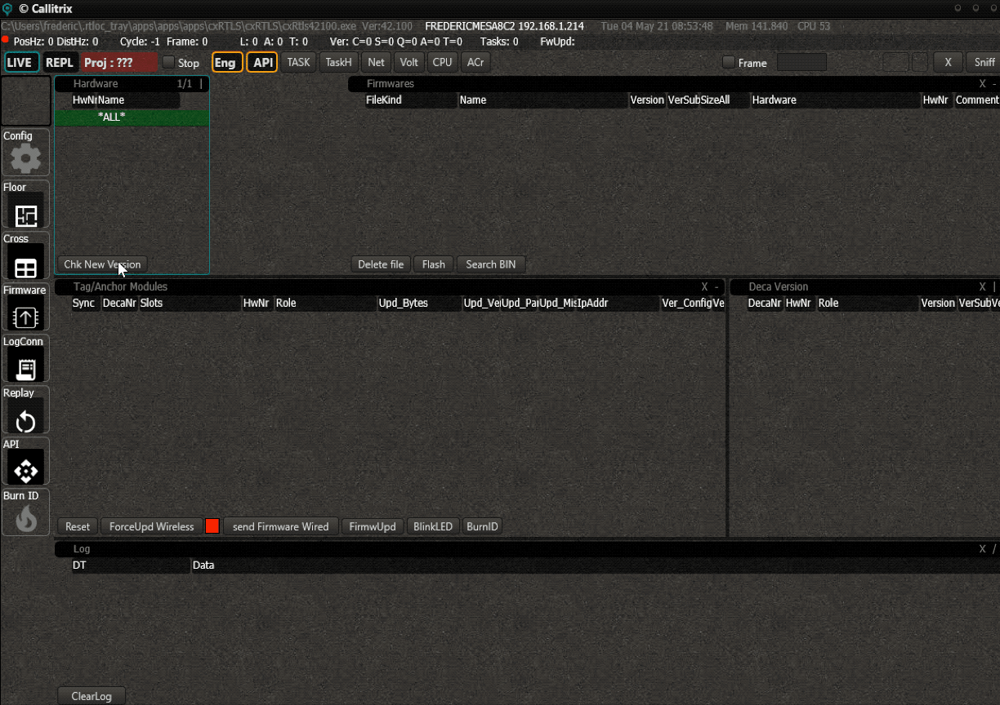

# Firmware Update
Whenever a new firmware is released or when you built your own with the DevKit, there are multiple ways to deploy that firmware to the system.
In this document you learn how to install the version you want on your system.

## Verify the version
In the panel _'Deca Version'_, you can verify the current version of all the tags and anchors.
The version will appear here once the system has received the information from the node. This will happen automatically. Keep in mind however that after booting the Manager, it might take some time before all the information is collected (typically 20 seconds).


## Import Firmware in Manager
Before you can update a node, you need to import the firmware in the Manager. There are 2 ways to do this:
 - Download the file from the server
 - Import the file manually
### Download from server
The most recent versions are available on our server. Click on _'Chk new version'_. Select the firmware you want and press _'Download'_. The file will appear in the list of available firmwares.


### Import Manually
You can also create your own firmware and import it manually.
Drag and drop the binary you want into the following directory:
```
c:\cxRTLS\bin\
```
The name of the file doesn't matter. You can drag in any type (tag, anchor, listener, ...) of firmware into this directory, the manager will recognize the type.


After doing this, press _'Search Bin'_ in the lower left corner of the screen.


Upon pressing the button, the firmwares will be imported in the system. You can verify the details in the _'Firmwarefiles'_ panel.


Here you have a full example:


## Update the Nodes
There are 3 ways to update a node:
 - Over-The-Air (OTA) via UWB
 - Over-The-Air via BLE
 - Reflashing with a programmer

Whenever your system is all set up and running, the easiest way is to perform an Over-The-Air (OTA) update via UWB. Everything can be done from within The Manager and no physical interactions are required. Multiple devices can be updated at the same time. 
You can also update individual nodes by connecting it to the RTLOC App (if the device has BLE). 
In case you have a board that has never been flashed before or if you want to update the bootloader, you can use a programmer to flash the firmwares on the board.

### OTA UWB
The OTA system consists of 2 steps. First you need to force the nodes you want into update mode. Then you can update it with the firmware of choice.
> `Note:` The _'min FW'_ in the upper right corner will determine the minimum required version for anchor- and tag firmware to load on the nodes. If these numbers are different from zero, you can only send versions that are equal or higher. This way you can prevent sending incompatible versions to the nodes.

#### Put the node in FW Update mode
First you need to select the firmware you want to update the node with in the _'Firmwares'_ panel.

Now select the node you want to update in the _'Tag/Anchor Modules'_ panel and press _'ForceUpd Wireless'_. The wired anchor will send a task to the selected node and it will go to the updating state.


Click on the red square to enable the firmware being sent. 


#### Update of the FW & Tracking the progress
Once the update has started, the progress of all the individual nodes can be tracked in the 'Tag/Anchor Modules'_ panel. A loading bar will appear under the column _'Upd_Bytes'_. You can see which how many and which parts are still missing.

You can repeat the process for any of the nodes you want to update.
You don't have to wait for other nodes to be finished to start other updates.

### OTA BLE
Nodes that have bluetooth can also be updated via our app (RTLOC Connect, see Play Store). 
### Programmer
Connect the programmer of choice (J-Link Segger or different) to the JTAG header of the node. Note that the DWM1001-Dev boards have an on-board programmer. Simply connecting them with a USB cable to your PC is enough.

In the Manager, select the firmware of choice and press _'Flash'_.
<!-- [Click here](LINKREQUIRED) for more information on setting up the toolchain. -->
