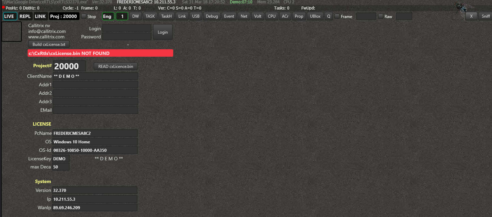
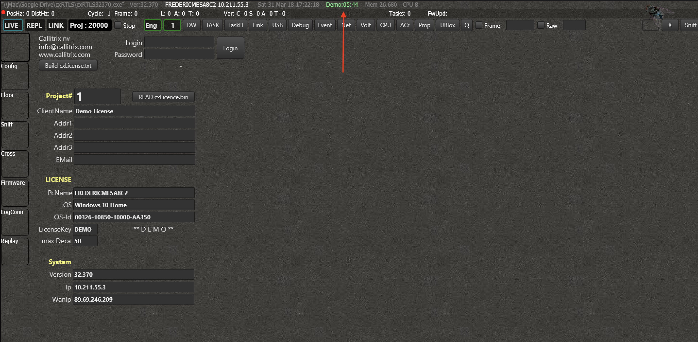
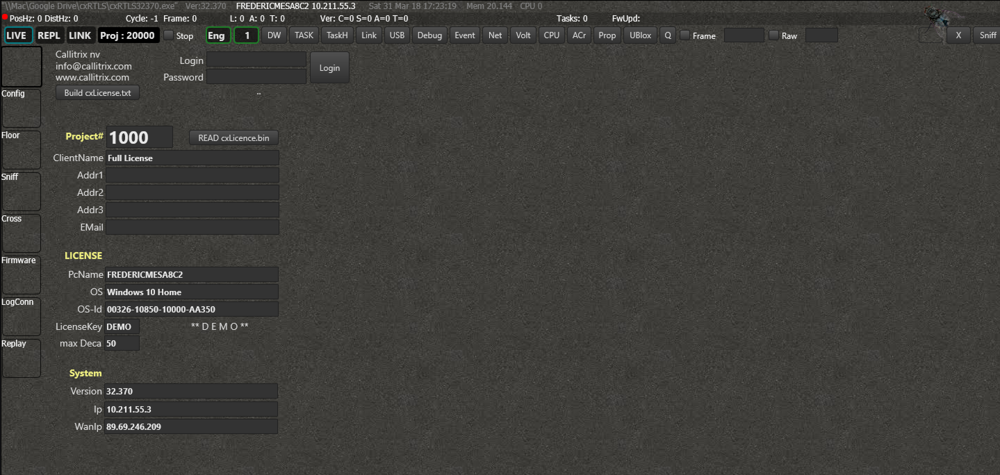
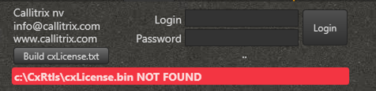
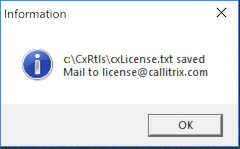

# Licenses
The features that are enabled in the program are based on the license you have. You can find more details on the licenses below.

:::tip 
  The most convenient way to download your license is to use the Desktop app. Go to your account, select a project, add your PC and download the license.
:::

## License types
Features can be enabled on a per-license basis. In general there are 3 license groups:
- No License
- Demo License
- Full License

### No License
Whenever you have no valid license, only a couple of features will be available. You can for example read out the console of the nodes, analyze the CPU and memory usage of the software and track TCP connections. All the menus are disabled however.



### Demo License
A demo license enables you to use all the basic  features and some extra's. You can locate tags, log and replay data, fully interact via the software API, etc...
Every 10 minutes however the program will not process any incoming information for 3 minutes. In the host bar is shown how long you can still use the program before it is interrupted, or how long you have to wait before it is reactivated.



### Full License
If you have a full license, you can use the software unlimited (except for the features that are not enabled) and uninterrupted.




## How to install the License
Whenever you start Engine for the first time, you probably don't have a license yet. To acquire one, press _'Build license.txt'_.

### From the Desktop app

If you have the [Desktop](/hub/) app installed, go to the profile view and press "Download license". If there's an indication that your PC has not been included in the license yet, you should do that first.

### Alternative: Manual license generation


A dialog message will appear and the file license.txt will be created on the following path:
```
c:/cxRTLS/license.txt
```
Send this file to the e-mail address written in the dialog box to receive the proper license file.



Within 24h after sending this e-mail, you will receive a file called license.bin, which you have to drop here:
```
c:/cxRTLS/license.bin
```
Doing this will automatically activate the license.

> Note that the license will only work on the computer on which you have generated license.txt. For other computers, you will have to redo the procedure.

## Get access to more features
[Send us a message](https://www.rtloc.com/#contact) if you want more activated features.
