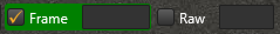
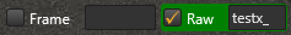
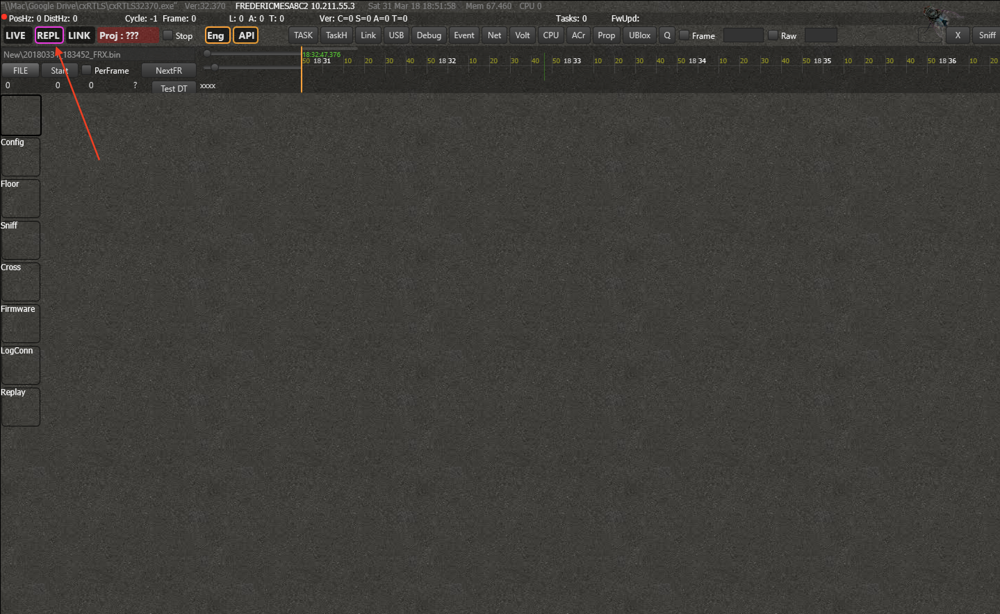
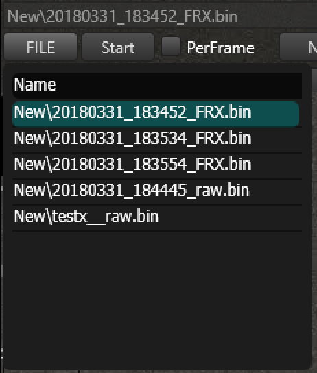
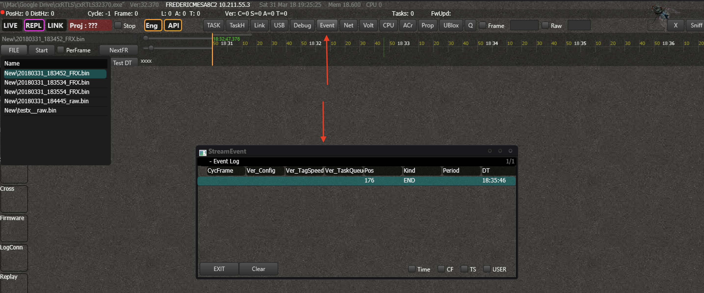

# Logging & Replay
With RTManager, you can log all the data and replay it as if it is happening live. This is particularly useful whenever you want to analyze a specific event or when you are developing a third-party application.

## Logging
You can log all the data to replay and analyse it afterwards.
There are 2 different kinds of logging:
- `Frame logging` - the logged data is already processed and filtered. All the essential information is stored in a minimal format. Use this in most cases.
- `Raw logging` - *all* the data is logged, will consume relatively large amount of storage space. Use this only if you need extensive debug facilities.

You can start logging data at any given time. All you have to to is check the checkbox in front of _Frame_ or _Raw_ and the logging starts immediately. You will notice that the box around frame will turn green. This will indicate that you are actually logging.
You can fill in a prefix for the generated file.



The logs will appear in the following directory:
```
c:\cxRTLS\Replay\
```
They are formatted as follows:
```
_PREFIX_DATE_TIME_FRX.ctx or PREFIX_DATE_TIME_raw.ctx
```

Don't worry if you enabled the logging too late. On the moment you press the checkbox, the system will immediately start logging, but will also add the data since you last disabled the logging and up till 5 minutes before the click. This makes that you never loose any valuable information.

## Replay
### Replay View Mode
Click on _'REPL'_ to switch to the `Replay View Mode`

Now that you are in replay mode, you can interact with the data as if it is coming in live. You can filter, search, calculate positions, send out data and more. The interactions that are not possible (interacting with nodes, changing the configuration, ...) are automatically disabled.

> Note that you can easily switch between Live and Replay mode.
> Whenever you are in Replay Mode, the Live mode will continue to process all the live data unless you manually disable it.

### Select File
Click on _'File'_ to open a window that shows all the logfiles under:
```
c:\cxRTLS\Replay\
```
If you have logged files on a different system, simply copy and paste the files to this directory. You can always store them in a subdirectory.



Now double click on the the specific file you want to activate it. When you press _'Start'_, the file will automatically start to play.
You can increase and decrease the speed with the two trackbars.

### Control
When you select the checkbox "PerFrame", the data will stop playing automatically and will only move forward one frame every time you click on the button _NextFR_.
This can be particularly useful when you are testing the PC API.

### Events
All the events of a log are readily visible in the _'Event window'_ that you can open in the _Action bar_.

Events can be:
- New Config file
- New Tagspeed file
- User Event
- User Comment
- Timestamp
- ...

By double clicking the event in the _'Event window'_, you will jump immediately to that data.

> Note that you can add and edit user comments during the replay and resave the log so that the comment is shown when you replay it again.
You can also crop the file so that you can get rid of all the useless information.


## API
The API is fully functional for the Replayed files. You can have the data outputted via a TCP or UDP connection. [Click here]() for more information on the API.

::: warning
Replay data is separated from live data in the API's. The standard TCP server for replays will use a different port. The MQTT API will use a different topic.
:::