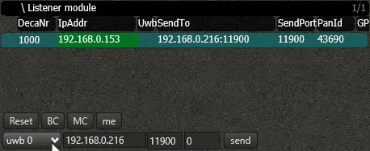
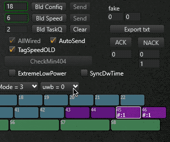
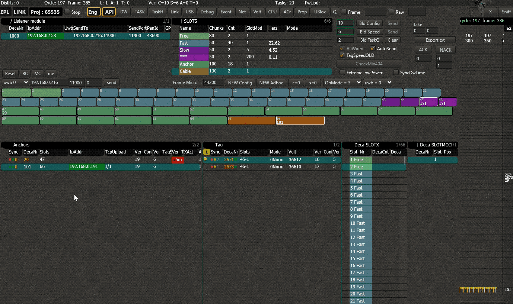

# RF profiles <Badge text="beta" type="warn"/>
In this page we'll explain how to switch between RF modes. We work with predefined profiles.

::: tip REQUIRED VERSIONS
RTManager - ^38000 

Tag - ^1.1.0

Anchor - ^1.1.0

Listener - ^1.1.0
:::

## Things to know
When changing the mode, precaution has to be taken.
When you change the profile of a node, it will start sending/listening on this new profile immediately. This means that it could become invisible to the system if there is no listener active on this profile. 
The anchors and tags are 

## Profiles
We support 6 profiles by default. The table below shows the most important parameters of each profile.
The following profiles can be selected.

| Profile | Channel | Datarate | Preamble Length | PAC Size |
|:-------:|:-------:|:--------:|:---------------:|:--------:|
|    0    |    2    |    6M8   |       256       |    16    |
|    1    |    2    |    6M8   |       123       |     8    |
|    2    |    2    |   850K   |       1024      |    32    |
|    3    |    3    |    6M8   |       256       |    16    |
|    4    |    3    |    6M8   |       128       |     8    |
|    5    |    3    |   850K   |       1024      |    32    |
|    6    |    5    |    6M8   |       256       |    16    |

## Listener 
The RF profile of the listener can be changed in the _Listener Module_.
Select the prefered mode, pick the listener of choice and press _Send_.
As soon as the listener has confirmed the choice, the number of the profile will appear in the column "Uwb".

## Config
Select the `Config` screen. Then select the prefered profile and press `Bld Config`.
This will make all wired anchors start sending with the new profile. Keep in mind that all the wireless anchors & all the tags (and possible the listener) are still using the previous profile and will not automatically see anchors with the updated profile.
It is normal that when you change the profile, the green box around the Config number stays red. This is because the listener is still listening on the previous profile and the system cannot confirm that the new config file has been received.

::: warning Note   
Keep in mind that you can only change the RF profile in the configfile whenever you are in `Debug mode`. 
:::

## Wireless Anchors & Tags
Wireless anchors and tags are not automatically aware of the updated profile. This is because the new RF profile is in the Config file, which now is distributed on this new profile. We somehow need to make them aware of the update.
To solve this, we can make one of the wired anchors temporarily distribute the config file on the previous profile, on which the wireless anchors & tags are still listening :sparkles:.

To achieve this, follow these steps:
 - Open the tasks
 - Select the task `UWB Profile`
 - Select the wired anchor via which the task has to  be sent, and the receiver of the task (could be the same)
 - The first parameter of the tasks corresponds to the RF profile. Fill in the correct number
 - Send the task

Now this anchor will start sending on the specified RF profile, which should correspond to the profile that the wireless anchors and tags are still active on.
The anchors and tags can now receive the new config, and become aware that they have to start sending on the new profile. As soon as this has happened to all the wireless anchors and tags, you can switch back the wired anchor back to the other profile.

Nodes that were inactive and don't have a config, will automatically start roaming all profiles to see if it can hear any signals. Whenever it does, it will lock onto this profile and start downloading the config.