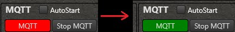
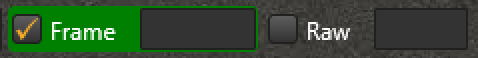
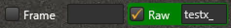

# Using Replays

## Introduction
Replays allow to
- try out our software / APIs without devices
- record important data to re-evaluate it at a later time

## Getting demo replays
To get some demo replays, you will need [RTLOC Desktop app](https://app.rtloc.com/download). Once installed, login using your account and download the license from account view. [License download instructions](../hub/license.html)

After that, download _'Demo Replays'_. These [replays](../manager/cxRTLS_replay.html#logging) allow you to replay all the data from positioning devices as if it is happening live. 


Lastly, download Engine and open it.


## Engine replay setup
RTLOC Engine is the main application that collects all of the data. Using this app we can view data live, replay it, send it over the internet and [more](../manager/). 

First, if we want to replay the data, we need to change the View Mode to Replay. Click on _'REPL'_ to switch to the `Replay View Mode`


Now we need to select a file we want to replay. Click on _'Dir'_ to open a window that shows all the logfiles under:
```
c:\cxRTLS\Replay\
```
If you have downloaded Demo Replays, you should see some *'DEMO_'* files. Now double click on any of the files to activate it (for this example we are using _'DEMO_FOOTBALL'_). When you press _'Start'_, the file will automatically start to play.


Then we need to make sure the engine is running:
1. Click on _'Eng'_ to open the engine menu.
2. Unselect _'Skip Engine'_ to activate the engine.
3. Click on _'Floor'_ in the left side [menu](../manager/cxRTLS_layout.html#menu).


If everything is correct you should see a circle moving around on the screen. More info about the manager [here](../manager/). 

## API setup

If you want to send the data from the Engine to our [cloud server](https://app.rtloc.com/) or any other computer there are multiple ways to do it.

### RTLOC cloud

The Engine app can send data to the Portal app as follows:
1. Click on _'API'_ in the left side [menu](../manager/cxRTLS_layout.html#menu).
2. Fill in the forms with the correct [information](https://app.rtloc.com/settings/connection).
3. Click _'Save'_.

4. Now click on the red _'MQTT'_ and it should change to a green color, indicating that everything is working.


Now all the data is sent to RTLOC cloud and can be viewed from [there](https://app.rtloc.com/).

### TCP_Binary connection

[TCP_Binary](/api/api_application.html) connection allows for fast and very compact transmission over TCP/UDP. It is useful for fast data transfers to your own servers.

In this example, we will be using [Python example](https://github.com/RT-LOC/API-examples/tree/master/Data%20API/TCP_binary/Python) code to create a connection when everything is running on our local machine. Make sure Python is installed ([link](https://www.python.org/downloads/)). 

:::warning
  Ensure you set the right port inside the code!
* 13100 - For Live data
* 13200 - For Replay data

Since we are using replays we need to use port 13200. Example inside _'tcp_client.py'_:
``` py
loop = asyncio.get_event_loop()
#NOTE: use port 13100 to connect to LIVE server, use 13200 to connect to REPLAY server.
coro = loop.create_connection(lambda: ApiClient(loop), ip_addr_server, 13200)
loop.run_until_complete(coro)
loop.run_forever()
loop.close()
```

:::

When everything is ready, use this in the command line (or terminal):
```
python3 tcp_client.py localhost  //<-- or IP address of your server
```

Now you should see something like this:


More TCP_Binary connection [examples](https://github.com/RT-LOC/API-examples/tree/master/Data%20API/TCP_binary).

### MQTT

For MQTT data connection, please refer to this [guide](/api/api_conns.html#_2-mqtt-data-connection).


## Recording replays
You can save all the data to a replay and as such analyse it at a later time.
There are 2 different kinds of logging:
- `Frame logging` - the logged data is already processed and filtered. All the essential information is stored in a minimal format. Use this in most cases.
- `Raw logging` - *all* the data is logged, will consume relatively large amount of storage space. Use this only if you need extensive debug facilities.

You can start logging data at any given time. All you have to to is check the checkbox in front of _Frame_ or _Raw_ and the logging starts immediately. You will notice that the box around frame will turn green. This will indicate that you are actually logging.
You can fill in a prefix for the generated file.



The logs will appear in the following directory:
```
c:\cxRTLS\Replay\
```
They are formatted as follows:
```
_PREFIX_DATE_TIME_FRX.ctx or PREFIX_DATE_TIME_raw.ctx
```

Don't worry if you enabled the logging too late. On the moment you press the checkbox, the system will immediately start logging, but will also add the data since you last disabled the logging and up till 5 minutes before the click. This makes that you never loose any valuable information.