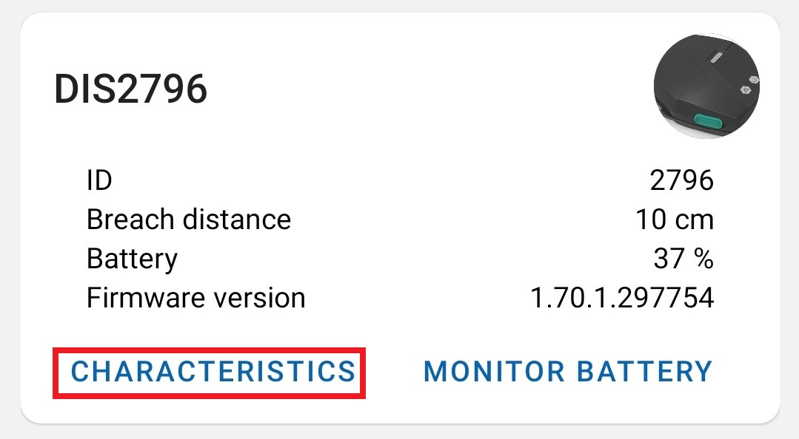

# Device configuration

Using our mobile app you can configure distancing devices to your needs. You can access the "Device config" screen by pressing on the bottom navigation button: 

or by pressing "Characteristics" in the "Home" screen:

## Characteristics

### Current time

Current time service refers to a Real Time Clock on the device itself. Current world time on the device is automatically set upon connecting with your phone, so no actions need to be taken here. Setting the time on the device is important for breach events that will later be used for analysis.

### Battery level

Battery level service displays the current battery level on the device. Every minute battery level is logged on your phone, you can view all of the logged data in the "Battery monitor" screen. 

### Device information

Here you can see some information about the device:

* Model number
* Manufacturer name - RTLOC
* Firmware revision
* Hardware revision

### Application service

Application service is the most important and contains all of the needed information for breach events.

#### IDs

Here you can set current device's UID and the Company ID. These setting shouldn't be changed often, most likely only once, during the setup.

#### MSD thresholds

Here you can set the minimum distance needed for a breach to happen, nearest breach distance and the minimum time needed for a breach to be logged.

#### MSD flags

MSD flags let you choose which functions should the device do or not do. For example you can turn off UWB breach events if you like to do so.

#### Event requester

With event requester you can manually offload events from the device itself. Every breach event is stored on the device (even if it is not connected to a phone/computer), so everytime you connect your device to a phone it will start offloading these events (and also sending them to the backend). But you also have the ability to do it manually. In addition to this you can also:

* Erase last offloaded event from the device (also done automatically when offloading).
* Erase everything.
* Generate 100 random events.
* View how many events are stored on the device and how many of them were offloaded.

#### Alarm settings

*under contruction*

## Notifications

You can imagine notifications as recurring data, if you subscribe to a notification your phone will always receive transmited data from your device to your phone.

### Current time

When turned on, you will receive constant data about the current time on the device. Only useful for debugging purposes.

### Battery level

When turned on, every minute you will receive data about the current battery level on the device. This notification is turned on by default upon connecting. This data can be viewed in the "Battery monitor" screen.

### Event data

When turned on, any breach event that occurs between your connected device and any other device will be received. This notification is turned on by default upon connecting. Also any event that is received through this notification is also sent to the backend. You can view this data either through the Portal app on in the "Event monitor" screen.