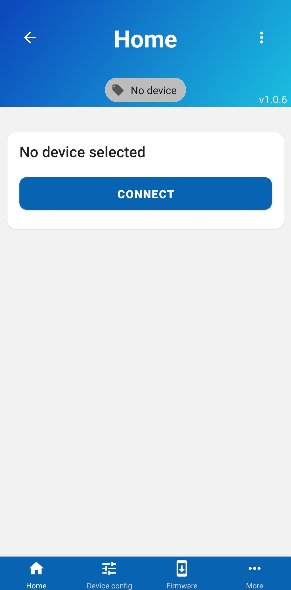
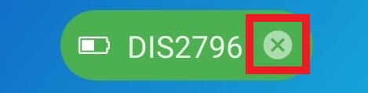

# Connecting devices

Power your device and open our Mobile app on your phone. Upon first launching the app you should see a "Connect" button. Press on it and you will be taken to another screen.

Press "Scan devices" and wait for your device to be found. Now press on an item in the list to get connected to it. You should see a green indicator at the top, indicating that you are connected:

## Disconnecting

If you wish to disconnect from the device, press the "X" visible on the green indicator

