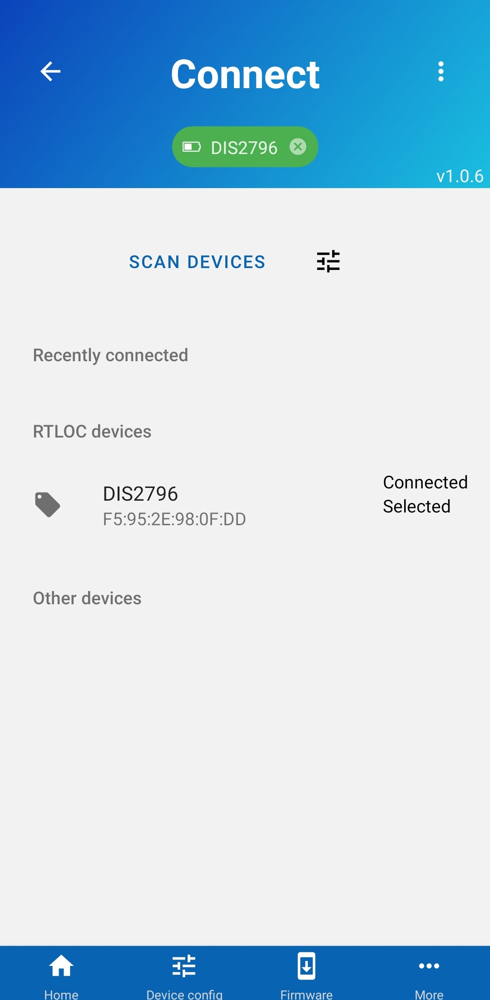

# Connecting devices

Power your device and open our Mobile app on your phone. From the app, scan for devices and once your device is found, press on it to get connected. You should see a green indicator at the top, indicating that you are connected:

