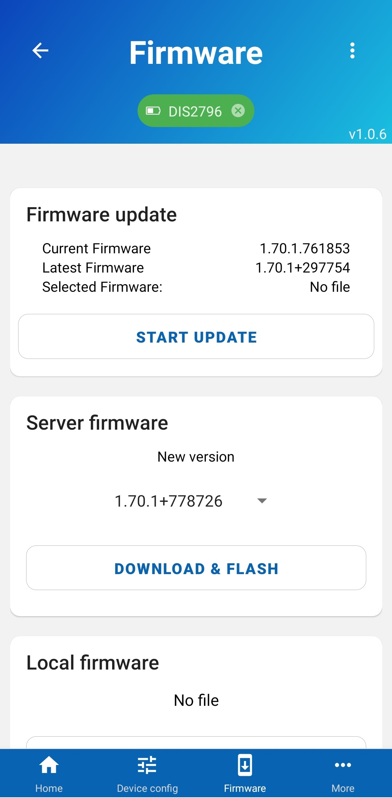

# Firmware update

A tag might have not have the most recent firmware. You can update your tags directly from your phone through Bluetooth. Navigate to the "Device firmware" screen and follow the instruction. You can find more detailed instructions [here](/reference/fwupdate.html#_2-over-ble-dfu).

