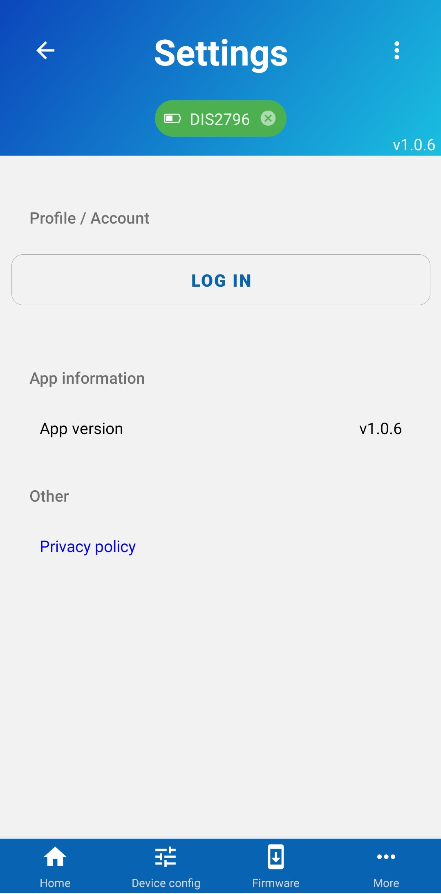

# Sending data to RTLOC backend

In order to start sending data to RTLOC backend you first need to Login, select a client and project. You can find the Login form in the "Settings" screen, which can accessed by pressing "three dots" icon located at the top right corner.

Once you are in the "Settings" screen, press the "Login" button and you will be taken to the Login form.

Enter you email and password, press "Login" and wait a bit, then you will be redirected back to the "Settings" screen.

When you are in the "Settings" screen you can choose what client and project you want your breach events to be sent to. If you only have one client and/or project, they will be selected automatically.

