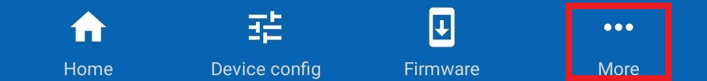
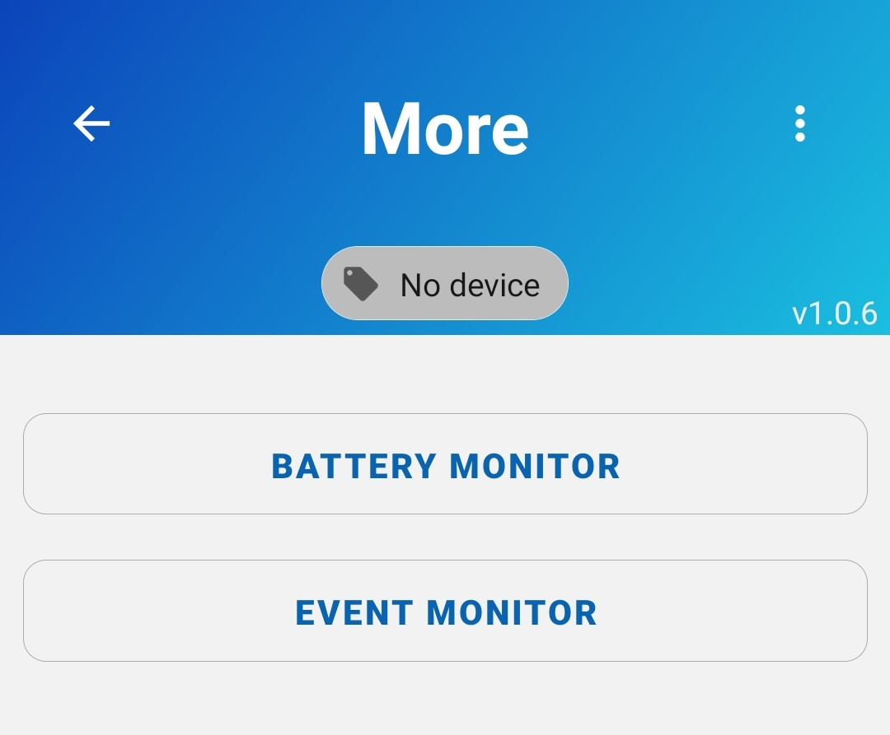
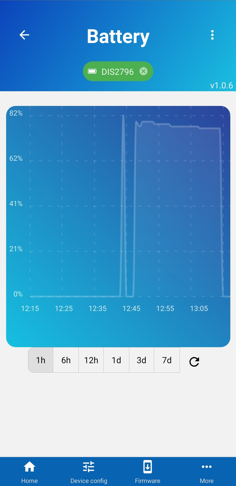
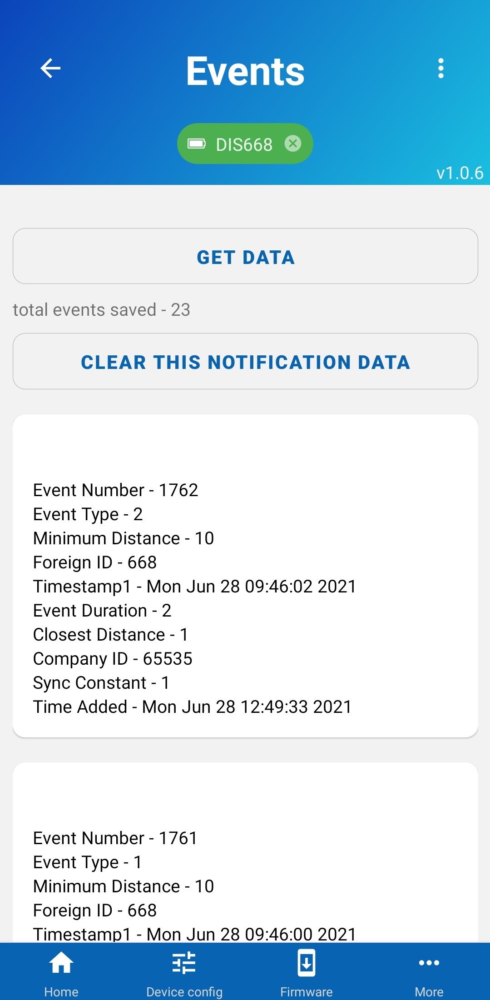

# Viewing data from Mobile app

Although most of the data is intended to be viewed from the Portal app, but some of the information can still be viewed right from the Mobile app.

To get started, press the "More" button in your bottom navigation and see what is available.

At the moment you can inspect battery levels throughout the day and events that your phone received.

## Battery monitor

In this screen you can view your device's battery level at different periods of time. This information is only useful for debugging purposes.

## Event monitor

Here in this screen you can see latest events your phone has recevied from the device. All of this information is also sent to the RTLOC backend and can be viewed from the Portal app.

