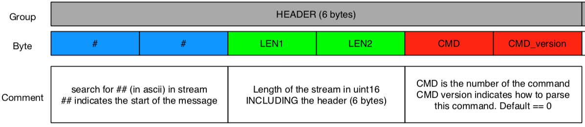

# Binary TCP or UDP

Real-time data (position data, tag/anchor statuses, sensor data, etc.) can be received over UDP/TCP or websocket in order to achieve low latency.

## Connection setup

1. Configure data transmission over UDP / TCP / websocket in our desktop application (in the API view)

2. Connect to your client to the correct IP + port

## Data format

The Binary API provides a compact representation of the real-time data stream. It can be accessed over UDP, TCP or websocket.

Live and replay data can be accessed over separated ports, as following:
* 13100 - For Live data
* 13200 - For Replay data

### Preamble

Every message will contain a preamble with the following format:

### Commands

Depending on the command indicated in the preamble, the rest of the message will be decoded as indicated below.

<ApiApp></ApiApp>

> the "GET" commands can be sent to retrieve the corresponding data
