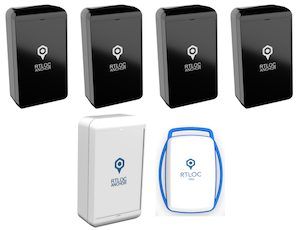
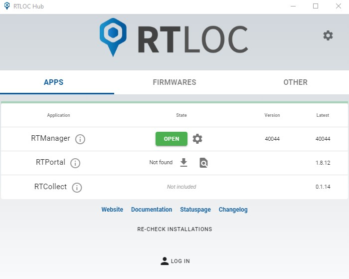
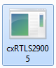
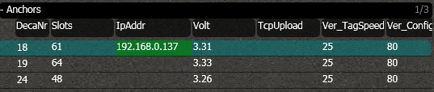
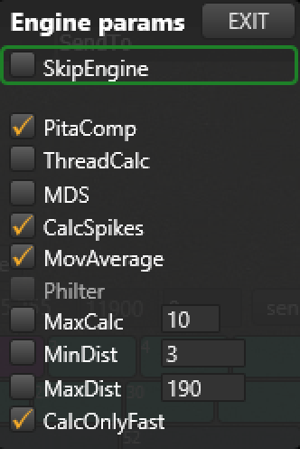

# Getting started with Position tracking

## Introduction

In this guide we will go through the setup of a professional RTLOC positioning system. You will learn the basics of the system and get familiar with some of the features. You will end up having a fully functional RTLS system and you can start tracking your first objects.

## Basic requirements
<!-- You will need a valid **license** for our professional RTLS. -->

Before you get started, make sure you have at least the following hardware:

### Positioning devices

You will - at a very minimum - need:
  - 4 Anchors
  - 1 Listener
  - 1 Tag

:::tip 
  NOTE: If you have bought the `Professional RTLS Kit`, everything will be included to get started.
:::
:::tip 
  Without any hardware, you can still use the software to play replays.
:::

### Networking equipment
  - 1 Switch
  - 2 Ethernet cables

### Power supplies
  - 4 Micro usb cables (type B) and batteries or socket adapters
  - PoE

  <!--  -->

### Other
A computer (desktop/laptop/tablet), preferably Windows OS

## Set up the software
A convenient way to manage our tools is the Hub app. You can get it at [https://app.rtloc.com/download](https://app.rtloc.com/download). (Currently Windows only, requires some space on the C drive)
You will need to log in using your account. If you don't have an account, [create one](https://app.rtloc.com/register). (If you've received an e-mail invite, preferably use that link)

You will need to download your license, from the account view of the Hub app. [License download instructions](../hub/license.html)

## Manager app configuration
Start the Manager app from the Hub app or locate the executable and start it. 

<!--  -->

You will get welcomed in the PC software.

:::warning
The software will run in a limited demo-mode without proper license.
[Activate your license (/manager/cxRTLS_license.html#how-to-install-the-license) for full access.
:::

## Device setup

### Update device firmware

A tag, anchor or listener might not have the most recent firmware. In that case you best [update the firmware](/reference/fwupdate) for the device by re-flashing it over USB.

### Power the devices

Once the boards are powered, you should see some lights blinking. There are a couple of [patterns](/reference/leds.html) possible. If all is going well, you should see a green light blinking on all boards. In the software, the numbers in the column DecaNr should turn right. This means data of these nodes is received.

Place the anchors in a strategic way. Hang them around the area you want to track. Make sure they are placed so that they are not blocked by big objects (especially metal). You can find some more hints on how to hang the anchors [here](/positioning/anchor_placement.html).

## Software setup
First we will make sure the listener (or dual anchor) is properly initiated. Go the the screen 'Config' in which you will see the _Listener Module_. All the connected listeners are listed here. It will show you to which IP address it is sending its data (this can be unicast, multicast or broadcast), together with the port.

Make sure you see the IP-address of your PC in the column _SendTo_, and the IP-address of the listener is colored green.

### Anchors & Tags
Now let's setup the anchors and the tags. You should see the anchor that is connected to the ethernet appear in the Anchor list.

By pressing _AutoSetup_, the system will automatically be set up and you won't have to bother about the details. Wait for about 15 seconds after pressing the button. You will see the green IP turn red for a short moment.
All the anchors & tags that are powered on will start to appear in the list.

### Floorplan
Now let's try visualizing the data. Open the 'Floor' view from the menu. 

#### Anchor Coordinates
Before we can track the tags, we need to know where the anchors are. 
You can calculate their (relative) positions automatically by pressing _AutoPos_. 
After a short while, you will see the anchors move to their position and you are ready to calculate your first tag positions.
Find more information on the anchor coordinates [here](/positioning/anchor_placement.html#calculating-anchor-coordinates).

#### Engine
Make sure that the internal engine is switched on. You can find the engine menu in the Action Bar. Whenever the engine is running, the engine menu button looks like this: 

Whenever it is switched of, it will looks like this: 

Click on it to open the menu:

Unselect "Skip Engine" to activate the engine.

Walk around with your tag and check that the tag is actually moving on the screen.

## Portal app
The position data can be visualized in our Portal application, which can be launched via the Hub app or via https://app.rtloc.com. 
The Manager app will need to have the correct MQTT configuration, as will be indicated in the Portal app settings. For the demo user:

## What's next?
You have just set up an easy RTLS system. Congratulations! Now there are several things you can do. Extend the area of interest by adding more anchors. Follow more objects by adding more tags. Reach the highest possible accuracy by calibrating your system. Consult the API documentation to find out how you can connect your own system to RTLOC. There's a lot to discover. A whole new world of possibilities is waiting for you.

* Setup [finetuning](/positioning/anchor_placement.html)
* Follow our [system guide](/guide/)
* Integrating with [our API](/api/)
