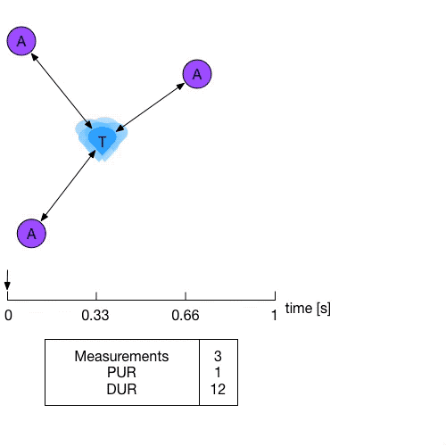
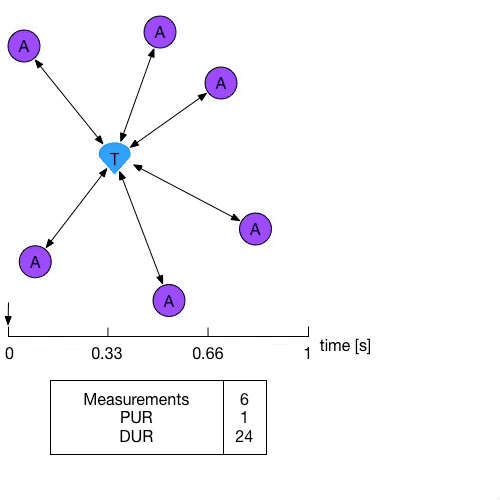

# Update Rate
The update rate in an RTLS system is a confusing term. It often refers to how many positions are calculated per second. But it is not a good way to benchmark a system and here's why.

## Position Update Rate (PUR)
### Definition
The position update rate is the total amount of **positions** calculated per second throughout the whole system.
A system can contain multiple tags that all have an individual position update rate (iPUR).
The PUR is limited because of two factors that are also directly related:
 - The limit of the iPURs.
 - The limit of the amount of tags a system can contain.

The sum of all iPURs equals the total PUR.

The position of a tag can be derived from a set of measurements. These measurements can be distances between a tag and an anchor (TWR) or time differences of arrival between a tag and two anchors (TDOA).
Using these measurements in a specialized algorithm can yield a mathematical solution which reflects the position of the tag.

### The issue
When you want to talk about system performance, the PUR is relatively easy to understand, but it doesn't show the whole picture.
The problem is that this number doesn't give you an idea of how many distances were used to calculate the position of the object.
The amount of distances used have a direct impact on the:
- Stability
- Accuracy
- Error sensitivity 

of the calculated solutions. 
This is mainly because you cannot assume that all measurements are 100% correct. There is always some error in the measurements, and sometimes these errors can become quite big (e.g. when there is a human body in between the tag and the anchor).

### The solution
The total amount of measurements says a lot more about the system performance because with more measurements you can calculate.
The more measurements you have, the better the aforementioned criteria will be.

## Measurement Update Rate (MUR)
This logically brings us to the concept of the Measurement Update Rate or the MUR. As for TWR and TDOA the kind of measurements are different, we need to make another distinction here.

### Distance Update Rate (DUR)
When you opt for a system based on Two-Way Ranging, the distance update rate is what you should be interested in.
This is the total amount of **distances** calculated per second throughout the whole system.

### Time Difference Update Rate (TDUR)
If you are using a Time Difference of Arrival system, the performance is best defined by the time difference (of arrival) update rate.
This is the total amount of **time differences** calculated per second throughout the whole system.

## An Example
### 3 Anchors, 1 Tag

### 6 Anchors, 1 Tag

