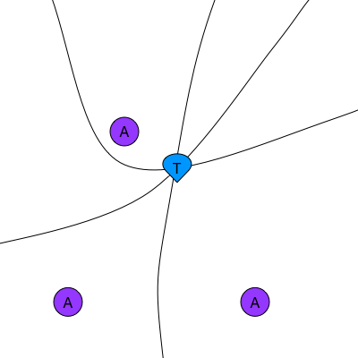
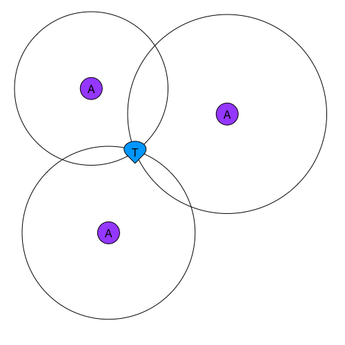
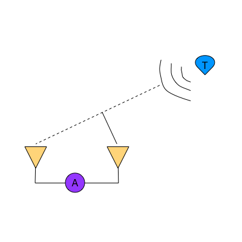

# Positioning algorithms

The position of an object can be determined in many different ways. It can be based on the **Time Difference Of Arrival (TDOA)** of the signals or by calculating the distance between the tags and the anchors via a method called **Two Way Ranging (TWR)**. Also measuring the Received Signal Strength (RSS) gives you an idea of the distance between the sender and receiver. When the angle of the propagation of the signal is measured, Angle of Arrival (AOA) could be applied. For each of the methods, different implementations and variations exist. All algorithms have their pros and cons, which we will discuss below.

The most relevant algorithms for us are TWR and TDOA, that's why they will be discussed in more detail.
TWR is more accurate than TDOA, but it is more CPU hungry and needs more signals in the air. By default, the engine runs on the PC and the tag itself is not aware of its position (TDOA1 and TWR1). For both schemes, there is however an alternative in which the positions are calculated on the tag itself (TDOA2 and TWR2).

## TDOA
Time Differences (TDs) yield hyperbolas. The position of the tag is calculated by calculating the intersection of the hyperbolas. Two anchors yield one TD (as opposed to only one anchor for one distance). This means a minimum of 3 anchors are necessary to calculate one 2D position and 4 anchors for a 3D position. The clocks of the nodes need to be synchronized. The better the synchronization, the higher the accuracy of the positions. Tags don't need to be active very often so this method is power consumption friendly. We differentiate between 2 schemes (TDOA1 and TDOA2) based on where the time differences are measured.

### TDOA1
The time differences are calculated on the anchors and offloaded to the system. The tags only need to 'blink' once for a position to be calculated, which means the tag power consumption is particularly low in this scheme.

### TDOA2
The time differences are calculated on the tags, and thus the position can also be calculated on the tag. If this position doesn't need to be offloaded to the system, an infinite amount of tags can be used in this scheme. This scheme is similar to how GNSS/GPS works.

## TWR
Two Way Ranging is a Time of Flight (TOF) method. The time of the propagation of the signal is measured between the transmitter and the receiver. A signal is sent from a tag to an anchor and back (hence the 'two way'). It needs to be sent back because the clocks of the anchors and tags are not synchronized. This means that the timestamps taken at the tag are on a different timebase than those taken on the anchor.
With the 4 timestamps (2x transmission and 2x reception) we can accurately calculate how long the signal has traveled back and forth between the nodes. Dividing that time by 2 yields the TOF and thus the distance.
The airtime of the nodes is higher then in TDOA, so less positions can be calculated.

### TWR1
The distances are calculated on the anchors and offloaded to the system. The position is calculated on a PC.

### TWR2
The distances are calculated on the tags, where the position is also calculated.

## AOA
Angle of Arrival is a method in which the direction of the propagation of the RF-signal is calculated on the receiving node, for example based on the phase difference measured on 2 different antennas. A 2D position can be derived from 2 angles with some simple triangulation.

## Comparison

| PARAMETER/ALGORITHM     |  TWR1   | TWR2 | TDOA1 | TDOA2 | AOA | RSSI |
|-------------------------|:-------:|:----:|:-----:|:-----:|:---:|:----:|
| Power consumption       |   ![-]  | ![o] | ![o]  | ![+] | ![-] | ![-] |
| Position Accuracy       |![+]![+] | ![o] | ![o]  | ![+] | ![-] | ![-] |  
| Position Stability      |![+]![+] | ![o] | ![o]  | ![+] | ![-] | ![-] |
| CPU load                |![+]     | ![o] | ![o]  | ![+] | ![-] | ![-] |
| Bandwith usage          |![-]     | ![o] | ![o]  | ![+] | ![-] | ![-] |
| Minimum amount of nodes | ![+]    | ![+] | ![o]  | ![+] | ![-] | ![-] |
| Tag Density             | ![-]    | ![o] | ![o]  | ![+] | ![-] | ![-] |
| Scalability             | ![+]    | ![+] | ![o]  | ![+] | ![-] | ![-] |

## Conclusion
Depending on your use-case, any algorithm could be the best for you. Are you mostly looking for accuracy? Then go for TWR. Is energy consumption the most relevant? Choose TDOA. 
Angle of Arrival can be useful if you don't want to have a lot of hardware and accuracy is not that important.

[+]:./img/algo/positive.png
[-]:./img/algo/negative.png
[o]:./img/algo/neutral.png
